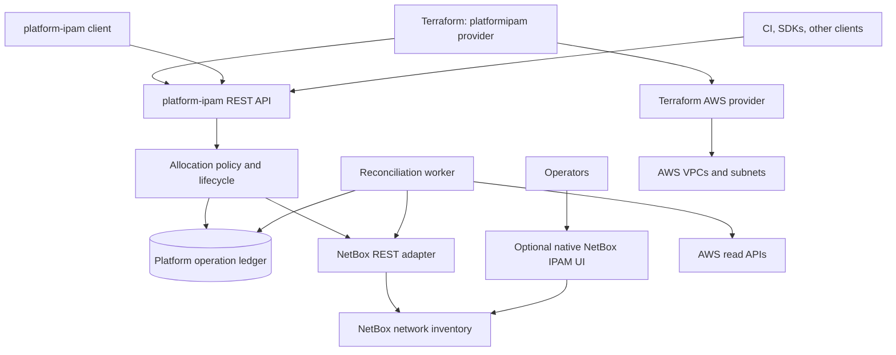

<div align="center">

# platform-ipam

**Policy-controlled IP address allocation for AWS networks, with NetBox as the inventory of record.**

[](https://github.com/mischapogr/platform-ipam/actions/workflows/ci.yml)
[](LICENSE)
[](go.mod)
[](#project-status)

[Quick start](#quick-start) · [Why](#why-this-exists) · [Documentation](docs/README.md) · [Decisions](docs/decisions/) · [Contributing](CONTRIBUTING.md)

</div>

---

Ask for a network, get back a CIDR that is durably yours. Consumers request
address space through a stable REST API — from Terraform, a CLI, or CI — and
the service picks a non-overlapping block, records it in a PostgreSQL ledger,
writes it to NetBox, and holds it until it is explicitly released.

```console
$ platform-ipam client reserve --key prod-euc1-orders --scope vpc \
    --env prod --region eu-central-1 --account 123456789012 --prefix-length 20
{
  "id": "alloc_73c73ac83b6f1f431e8da56122353f05",
  "allocation_key": "prod-euc1-orders",
  "cidr": "10.64.16.0/20",
  "state": "RESERVED",
  "pool_id": "pool_prod_euc1"
}
```

Ask again with the same key and you get the same CIDR — not a second one.

## Why this exists

Address space is easy to hand out and expensive to get wrong. Two teams
receiving overlapping ranges is discovered months later, when the VPCs need to
peer. This project treats that as the property to protect:

- **One allocation per logical identity.** A stable `allocation_key` survives
  lost responses, duplicate requests, restarts, and timeouts. Retrying returns
  the same CIDR rather than acquiring another.
- **Absence of evidence is not evidence of absence.** A failed, partial, or
  stale AWS scan is `UNKNOWN`, never proof that a range is free. Incomplete
  observation blocks reuse instead of enabling it.
- **Release is not immediate reuse.** Deleting an allocation records intent and
  starts a quarantine. Space returns to the pool only after complete evidence
  that nothing is still using it.
- **Clients hold no policy.** The API resolves tenant, account, environment,
  and region from the authenticated principal. No client picks its own CIDR,
  pool, or tenancy — not the CLI, not Terraform.

The reasoning behind each of these is recorded in
[decision records](docs/decisions/).

## Architecture



The PostgreSQL ledger is the authority for allocation identity and lifecycle.
NetBox is the authority for network inventory. The reconciliation worker
observes AWS read-only — it never creates or deletes cloud resources.

## Quick start

You need **Docker** and **Docker Compose**. You do **not** need Go or Terraform
installed; both run from pinned images.

```sh
git clone https://github.com/mischapogr/platform-ipam.git
cd platform-ipam/deploy/compose && ./create-env.sh && cd ../..

./tests/e2e/run-e2e.sh
```

That builds the stack, starts PostgreSQL, NetBox and the API and worker,
bootstraps NetBox credentials and inventory, and runs the end-to-end suite —
reserving address space through REST, the CLI, and Terraform, then asserting
the result in the NetBox inventory an operator sees.

The API is published on `127.0.0.1:8080` and the NetBox UI on
`127.0.0.1:18000`; `IPAM_API_PORT` and `NETBOX_PORT` in `deploy/compose/.env`
move them when another project already holds a port. See [the Compose guide](deploy/compose/README.md) for
running the stack without the test suite.

## Using it

| Client | Where to look |
| --- | --- |
| **Terraform** | [`examples/terraform/vpc`](examples/terraform/vpc/main.tf) and the [provider contract](docs/CLIENTS.md) |
| **CLI** | [`platform-ipam client`](docs/CLIENTS.md) — ships in the service image |
| **REST** | [API v1 contract](docs/API_V1.md) and [`api/openapi.yaml`](api/openapi.yaml) |
| **Python** | [`examples/python/reserve.py`](examples/python/reserve.py) — illustrative, not the supported path |

```hcl
resource "platformipam_allocation" "vpc" {
  allocation_key = "prod-eu-central-1-orders"
  scope          = "vpc"
  environment    = "prod"
  region         = "eu-central-1"
  account_id     = var.aws_account_id
  prefix_length  = 20
}

resource "aws_vpc" "orders" {
  cidr_block = platformipam_allocation.vpc.cidr
}
```

A `plan` never allocates. The CIDR is unknown until `apply` commits it.

## Project status

**Pre-release.** The local stack works end to end and is covered by 16
end-to-end tests across REST, CLI, Terraform, and the NetBox operator surface,
plus an opt-in browser check.

Verified in this repository:

- Address-space behaviour: alignment, pool containment, disjointness across
  mixed prefix lengths, idempotent replay, refused prefix lengths, capacity
  arithmetic
- Reservation through all four consumer surfaces, agreeing on one allocation
- Terraform plan/apply/re-plan/destroy lifecycle

**Not verified, and not claimed:** live AWS onboarding, a Kubernetes rollout,
provider distribution and installation (development uses a Terraform CLI
development override, which never exercises registry resolution, checksums, or
the lock file), and NetBox compatibility beyond the single pinned version.

The API contract may change before `1.0.0`. See [CHANGELOG.md](CHANGELOG.md).

> **Note on naming:** the project, service, image, and chart are all
> `platform-ipam`. Some checkouts are still in a directory named
> `platform-imap`; that is a typo in the directory name only.

## Documentation

| Document | Purpose |
| --- | --- |
| [Documentation index](docs/README.md) | Everything below, plus validation status |
| [Implementation plan](docs/IMPLEMENTATION_PLAN.md) | Scope, storage, correctness, delivery phases, acceptance gates |
| [API v1](docs/API_V1.md) | Requests, idempotency, lifecycle, release, errors |
| [Clients](docs/CLIENTS.md) | Terraform, CLI, REST, Python, AWS CLI, CI |
| [AWS integration](docs/AWS_INTEGRATION.md) | Inventory, cross-account IAM, coverage, onboarding |
| [NetBox integration](docs/NETBOX_INTEGRATION.md) | Inventory mapping, adapter, operator UI, access control |
| [Deployment](docs/DEPLOYMENT.md) | Compose for development; Helm/Kubernetes for stage and prod |
| [End-to-end suite](tests/e2e/README.md) | What is actually verified, and how to run it |
| [Decision records](docs/decisions/) | Why the system is shaped this way |

## Contributing

Contributions are welcome — read [CONTRIBUTING.md](CONTRIBUTING.md) first, and
open an issue before writing anything substantial. Changes that touch
allocation, lifecycle, or an adapter need an end-to-end test: several defects
here passed every unit test and only failed against a running stack.

Please follow the [Code of Conduct](CODE_OF_CONDUCT.md). For vulnerabilities,
follow [SECURITY.md](SECURITY.md) rather than opening a public issue.

## Licence

[Apache License 2.0](LICENSE) — free to use, modify, and redistribute, in both
proprietary and open-source projects, provided the licence and
[NOTICE](NOTICE) are retained. See
[ADR 0005](docs/decisions/0005-PUBLIC_RELEASE_LICENCE_AND_DISTRIBUTION.md) for
why this licence was chosen.

Copyright 2026 Mischa Pogrebnyak ([@mischapogr](https://github.com/mischapogr)).
