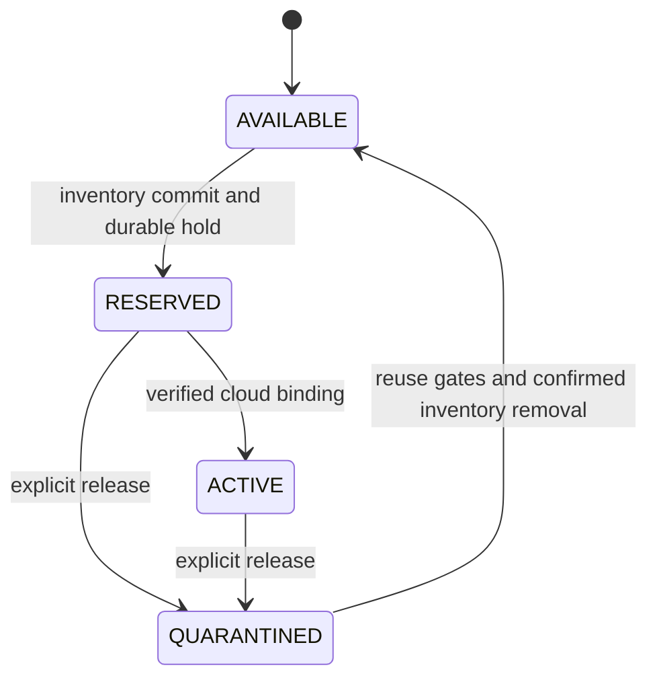

# API v1 and allocation lifecycle

Status: implemented v1 contract, 2026-09-08. [`api/openapi.yaml`](../api/openapi.yaml) is the schema authority; this document explains lifecycle and consumer behavior. Examples require a configured local or deployed API.

## 1. Transport and identity

Use HTTPS and JSON under `/v1`. Authenticate with `Authorization: Bearer <platform-access-token>`. Resolve tenant and allowed account/environment/region combinations from the authenticated principal. Never accept `tenant_id`, `owner`, or caller-supplied role claims as authorization. A submitted account ID must be authorized; omission is valid only when identity/policy selects exactly one target.

Use opaque, globally unique string identifiers with type prefixes, such as `alloc_01`, `op_01`, and `pool_prod_euc1`. Examples use shortened IDs; production IDs should have at least 128 bits of randomness. IDs are stable and never encode a NetBox object ID. Timestamps are RFC3339 UTC.

Reject unknown request properties with `422`; response clients must tolerate additive fields. `X-Request-ID` appears on every response. Authenticate/authorize before idempotency lookup, including replays. Unauthorized object IDs return `404` without revealing another tenant's allocation.

An identity may also carry `role: operator` ([ADR 0011](decisions/0011-WHAT_AN_OPERATOR_WHO_IS_NOT_A_TENANT_MAY_SEE.md), stage two): a read-only principal with no tenant. The role is set once, server-side, in the identity file `config.Load` decodes — never inferred from a bearer token or an OIDC claim, so the "never accept a caller-supplied role claim" rule above is unaffected. An operator reads across tenants on `GET /v1/pools`, `GET /v1/pools/{id}/capacity`, `GET /v1/allocations`, `GET /v1/allocations/{id}` and `GET /v1/findings`; every write (`POST`, `PATCH`, `PUT .../binding`, `DELETE`) and `GET /v1/operations/{id}` are refused for it exactly as they are for any principal with no tenant, and `GET /v1/operations/{id}` stays tenant-only by design in v1, not by omission. Every operator read is recorded in the application log — see section 9 — which is a diagnostic trail, not the ledger's tamper-evident audit trail.

## 2. Endpoints

| Method and path | Behavior | Success |
| --- | --- | --- |
| `POST /v1/allocations` | Reserve a network, or recover/replay the same logical request | `201` new, `200` existing, `202` unresolved operation |
| `GET /v1/allocations/{id}` | Read a committed allocation, including quarantine/released state | `200` |
| `GET /v1/allocations` | List authorized allocations; filters `allocation_key`, `scope`, `environment`, `region`, `state`, `parent_allocation_id` | `200` |
| `PATCH /v1/allocations/{id}` | Replace mutable `description` and/or `labels` with revision precondition | `200` |
| `PUT /v1/allocations/{id}/binding` | Submit one AWS resource candidate for independent verification | `202` verification, `200` already verified matching binding |
| `DELETE /v1/allocations/{id}` | Persist release intent and quarantine; does not delete cloud resources | `202` quarantine accepted, `204` already RELEASED |
| `GET /v1/operations/{id}` | Read pending or terminal durable operation; tenant-only, never granted to an operator (ADR 0011) | `200` |
| `DELETE /v1/operations/{operation_id}` | Cancel the caller's own pending `RESERVE` the platform has itself declared stuck via an open `reservation_stuck` finding on the allocation ([ADR 0013](decisions/0013-A_RESERVATION_THAT_CAN_NEVER_COMPLETE.md)); no body; tenant-only, never granted to an operator (same `404` as `GET /v1/operations/{id}`) | `200` with the cancel report |
| `GET /v1/pools` | Read authorized pool summaries and policies | `200`, or `403 no_eligible_pool` if the caller's tenant is eligible for no pool |
| `GET /v1/pools/{id}/capacity` | Read capacity by lifecycle/size with observation timestamp | `200` |
| `GET /v1/findings` | Read authorized drift/coverage findings | `200` |

All collection endpoints accept opaque `cursor` and `limit` (default 50, maximum 200). Return `{ "items": [], "next_cursor": null }`; order by immutable ID and use cursor pagination without promising a snapshot across pages. This pagination contract is independent of NetBox pagination. Key lookups still return an array of zero or one authorized allocation.

`GET /v1/pools` is the one exception to "an empty list is a normal `200`" ([ADR 0011](decisions/0011-WHAT_AN_OPERATOR_WHO_IS_NOT_A_TENANT_MAY_SEE.md)): it answers `403 no_eligible_pool` when the authenticated identity's tenant is eligible for no pool, decided on the full list before any pagination, so an eligible caller whose cursor pages past the end still gets an ordinary empty `200`. `GET /v1/allocations` and `GET /v1/findings` are unaffected and keep answering an empty `200` list for the same identity — "there is nothing" remains a fact those two endpoints can state.

Health endpoints `/livez` and `/readyz` are deployment interfaces outside the allocation API. No consumer endpoint directly sets lifecycle, selects a CIDR, mutates pools, resets keys, or forces reclamation.

## 3. Reservation request

The minimal request from the original proposal remains supported when the authenticated context selects a single AWS account:

```http
POST /v1/allocations
Authorization: Bearer <platform-access-token>
Content-Type: application/json
Idempotency-Key: reserve-prod-eu-central-1-orders-v1
```

```json
{
  "scope": "vpc",
  "environment": "prod",
  "region": "eu-central-1",
  "prefix_length": 20,
  "allocation_key": "prod-eu-central-1-orders"
}
```

An explicit-account example is available in [allocate.json](../examples/rest/allocate.json).

| Property | Rules |
| --- | --- |
| `allocation_key` | Required; 1–128 ASCII letters, digits, `.`, `_`, `-`, or `/`; first character alphanumeric. Unique within the authenticated tenant for the lifetime of the service |
| `scope` | Required; `vpc` or `subnet` once enabled |
| `environment` | Required; authorized configured identifier, 1–32 characters |
| `region` | Required; onboarded AWS region, validated against configuration |
| `prefix_length` | Required integer; technical IPv4 bounds plus pool policy; subnet must fit its parent |
| `account_id` | Optional 12-digit string; inferred only for exactly one eligible account |
| `address_family` | Optional; default `ipv4`; reject other values in initial v1 |
| `parent_allocation_id` | Required for `subnet`, forbidden for `vpc`; parent must belong to same tenant and target |
| `availability_zone_id` | Optional for `subnet`, forbidden for `vpc`; stable AWS AZ ID such as `euc1-az1`, validated for the target account/region |
| `description` | Optional string, maximum 512 characters; default empty |
| `labels` | Optional map, maximum 20 entries, keys up to 64 and values up to 256 characters; defaults empty; cannot set reserved `platform-ipam/` metadata |

All identity/sizing/placement properties are immutable after creation. `description` and `labels` are mutable through PATCH only. AWS account IDs remain strings to retain leading zeros.

For a subnet:

```json
{
  "allocation_key": "prod-eu-central-1-orders-private-euc1-az1-v1",
  "scope": "subnet",
  "environment": "prod",
  "region": "eu-central-1",
  "account_id": "123456789012",
  "prefix_length": 24,
  "parent_allocation_id": "alloc_01",
  "availability_zone_id": "euc1-az1"
}
```

A RESERVED parent can accept children: this supports a single Terraform dependency graph. A QUARANTINED/RELEASED parent cannot. Admission and parent release share a transaction lock, so neither can race past the other's checks.

## 4. Allocation response

`201 Created`, with `Location: /v1/allocations/alloc_01` and `ETag: "7"`:

```json
{
  "id": "alloc_01",
  "allocation_key": "prod-eu-central-1-orders",
  "scope": "vpc",
  "environment": "prod",
  "region": "eu-central-1",
  "account_id": "123456789012",
  "address_family": "ipv4",
  "prefix_length": 20,
  "cidr": "10.64.0.0/20",
  "pool_id": "pool_prod_euc1",
  "parent_allocation_id": null,
  "availability_zone_id": null,
  "description": "Orders production VPC",
  "labels": { "service": "orders" },
  "state": "RESERVED",
  "revision": 7,
  "policy_version": "2026-09-07.1",
  "binding": null,
  "release_requested_at": null,
  "quarantine_until": null,
  "release_blockers": [],
  "inventory_sync": "CURRENT",
  "last_observed_at": null,
  "created_at": "2026-09-07T12:00:00Z",
  "updated_at": "2026-09-07T12:00:00Z",
  "links": {
    "self": "/v1/allocations/alloc_01",
    "inventory": "https://netbox.example.com/ipam/prefixes/421/"
  }
}
```

The CIDR becomes usable only in a committed allocation response with state RESERVED or ACTIVE. `inventory_sync` is `CURRENT`, `PENDING`, or `CONFLICT`; it distinguishes the ledger lifecycle from delayed NetBox metadata updates. It must not change a CIDR already issued. `last_observed_at` is the last successful relevant cloud observation, not the time of a failed scan.

`links.inventory` is optional, opaque, and omitted when UI integration is disabled or the caller is not entitled to a link. Clients must never parse it for allocation behavior. RELEASED objects omit the inventory link after prefix deletion.

An operator's response to `GET /v1/allocations` and `GET /v1/allocations/{id}` additionally carries `tenant_id`, the owning tenant (ADR 0011). The key is absent — not `null` — from every other caller's response to the same read, including the owning tenant's own: `Allocation` in `api/openapi.yaml` declares it optional, and an optional property that does not apply is left out of the object rather than sent as `null`, which this contract reserves for a field every caller always receives but that sometimes has no value (`parent_allocation_id`, `binding`, and the rest above).

Mutable PATCH uses `If-Match: "7"`. Omitted properties remain unchanged; provided `labels` replaces the entire labels map. Null values are invalid. Reject attempts to modify immutable properties. Every successful mutation increments `revision`; stale revisions return `412`. PATCH is disallowed after release intent. No mutation extends a reservation or quarantine through a read request.

## 5. Idempotency and lost responses

`allocation_key` is the permanent logical identity. Normalize defaulted fields and the resolved account before hashing. A new request with the same tenant/key and matching immutable identity returns the same allocation ID/CIDR, even if it has a different HTTP idempotency key. Mutable fields from POST never overwrite existing values; clients use PATCH to change them. QUARANTINED or RELEASED identities return `409 allocation_key_retired` on create and cannot be resurrected.

`Idempotency-Key` is required on POST, PATCH, and binding PUT; it is 1–128 visible ASCII characters. Store it under tenant, method, and canonical path, with the normalized body hash. The same key with a different body returns `409 idempotency_mismatch`. HTTP request records may expire after 30 days once terminal; allocation-key tombstones remain. DELETE is inherently idempotent and needs no body or idempotency header.

For POST retries, return the same logical resource or operation, using its current representation. A matching key does not bypass a subsequent release: once release was requested, return `409 allocation_key_retired` rather than a cached RESERVED response. PATCH replays acknowledge the original change and return current state without reapplying it, even when the original revision is now stale. Authenticate and detect body conflicts before replaying.

If the allocation has not yet safely committed, POST returns `202 Accepted` with `Location: /v1/operations/op_01`, `Retry-After: 2`, and an operation object. Polling is read-only:

```json
{
  "id": "op_01",
  "type": "RESERVE",
  "status": "PENDING",
  "allocation_id": "alloc_01",
  "result": null,
  "error": null
}
```

Operation status is `PENDING`, `SUCCEEDED`, or `FAILED`. SUCCEEDED includes `result: {"allocation_id":"alloc_01"}` and the client then reads the allocation. FAILED includes the error object described below. A terminal operation's status/result identity never changes. `GET /allocations/{id}` for an uncommitted known operation returns `409 allocation_pending` with its operation ID, not a misleading `404`. List endpoints omit uncommitted allocations.

`409 allocation_pending` is scoped to exactly one caller: the **owning tenant**, reading its own uncommitted allocation while its `RESERVE` or `ADOPT` operation is still `PENDING`. The operation ID rides in `error.details.operation_id`:

```json
{
  "error": {
    "code": "allocation_pending",
    "message": "The allocation is not yet committed; its reservation is still being worked on. Read the named operation.",
    "request_id": "req_03",
    "retryable": true,
    "details": { "operation_id": "op_01" }
  }
}
```

Every other caller of this read keeps the answer it always had. Another tenant and an unknown ID stay `404` with one identical body (section 1's privacy rule: an unauthorized ID must not be distinguishable from a nonexistent one). An operator stays `404` too ([ADR 0011](decisions/0011-WHAT_AN_OPERATOR_WHO_IS_NOT_A_TENANT_MAY_SEE.md)): an uncommitted hold is exactly as invisible to an operator as it was before this code existed, never leaked through a different status. An uncommitted hold whose operation is *not* `PENDING` -- none exists for it at all, or one was left `FAILED` inside a cancel's or an abandon's fence window ([ADR 0012](decisions/0012-ABANDONING_AN_ADOPTION_THAT_CANNOT_BE_FINISHED.md), [ADR 0013](decisions/0013-A_RESERVATION_THAT_CAN_NEVER_COMPLETE.md)) -- also stays `404`: that window has its own withdrawal-in-progress signal on `POST /v1/allocations` (`reservation_cancelling`/`adoption_abandoning`, above) and this read makes no promise about it. `List` is unaffected either way: it already omits every uncommitted allocation, `409`-eligible or not.

A `RESERVE` the platform itself has declared stuck (a `reservation_stuck` finding, [docs/FINDINGS.md](FINDINGS.md)) can be withdrawn by the tenant that holds it: `DELETE /v1/operations/{operation_id}` ([ADR 0013](decisions/0013-A_RESERVATION_THAT_CAN_NEVER_COMPLETE.md)). Its terminal representation sits beside the pending one above:

```json
{
  "id": "op_01",
  "type": "RESERVE",
  "status": "FAILED",
  "allocation_id": "alloc_01",
  "result": null,
  "error": {
    "code": "reservation_cancelled",
    "message": "Reservation cancelled by the tenant that requested it; the uncommitted hold was withdrawn.",
    "request_id": "req_02",
    "retryable": false
  }
}
```

`allocation_id` still names the withdrawn hold, but the allocation row is gone: `GET /v1/allocations/alloc_01` now answers `404`, and this operation keeps answering `200` with exactly this body for ever. The operation's `id` is unchanged by the cancel; only its `status` and `error` moved from `PENDING`/`null` to this terminal pair.

Keep operations queryable for at least 30 days after termination and while pending. If a terminal operation was purged, clients recover through the permanent allocation key. Retain compact failed-create key evidence; retry a definitively failed allocation under a new logical key or an audited operator recovery, never silently choose another CIDR after an ambiguous failure. The one exception is a cancelled `RESERVE`: retry it under the **same** `allocation_key`, because the cancel is itself the audited recovery and the tenant performed it, so the retry is a fresh reservation rather than a replay of the withdrawn attempt (ADR 0013).

## 6. Binding and activation

Tag cloud resources with `platform-ipam:allocation-id=<allocation-id>` and `platform-ipam:allocation-key=<allocation-key>`. Tags are correlation evidence; authorization comes from the service's expected tenant/account/region and its trusted AWS observation.

The reconciler can discover a binding from those tags. A CLI/SDK can also submit a candidate:

```http
PUT /v1/allocations/alloc_01/binding
Authorization: Bearer <platform-access-token>
Content-Type: application/json
Idempotency-Key: bind-orders-vpc-v1
```

```json
{
  "provider": "aws",
  "resource_type": "vpc",
  "resource_id": "vpc-0123456789abcdef0",
  "account_id": "123456789012",
  "region": "eu-central-1"
}
```

For subnets, use `resource_type: "subnet"` and an AWS subnet ID. The service verifies CIDR, target account/region, both allocation tags, expected VPC binding/parent and optional AZ. A v1 VPC binding must match its primary IPv4 `CidrBlock`; a matching secondary association alone cannot activate it. All associations still count as occupancy. A parent need not be ACTIVE for child reservation, but the worker verifies the parent binding before child activation. Invalid or ambiguous resources produce a failed verification operation and leave the reservation intact.

PUT returns an operation of type VERIFY_BINDING until verification completes; an already verified identical binding returns the allocation with `200`. A different existing binding returns `409 binding_conflict`. Resource replacement requires a new allocation identity in initial v1. QUARANTINED/RELEASED allocations reject new binding candidates and never reactivate automatically.

The verified allocation `binding` includes the above fields plus `verified_at`. Background discovery and explicit PUT use the same checks and locks. The API cannot create, resize, or delete an AWS resource.

## 7. Lifecycle and release gates



AVAILABLE is a property of space, not an allocation object. On the last transition, the old allocation becomes RELEASED. Its permanent key remains retired; reuse of the CIDR creates a new ID/key. Pending external operations are tracked separately, not as a successful reservation.

| State | CIDR held? | Allowed next action |
| --- | --- | --- |
| RESERVED | Yes | Bind, edit metadata, create child if VPC, or request release |
| ACTIVE | Yes | Read, edit metadata, create child if VPC, or request release |
| QUARANTINED | Yes | Read, repeat DELETE, gather observations, eventually reclaim |
| RELEASED | No | Read audit/tombstone; DELETE is a no-op |

DELETE persists the release timestamp, sets QUARANTINED, preserves bindings and the CIDR hold, and queues NetBox metadata projection. It returns the allocation with `202` only after this database transaction commits. It may accept release while a cloud resource still exists: that resource becomes an explicit reuse blocker. The service never interprets release intent as permission to delete AWS infrastructure.

A repeated DELETE returns `202` with the same quarantine start while reclaiming, or `204` after RELEASED. It must not reset the quarantine clock. DELETE of an unknown or unauthorized ID returns `404`. DELETE of a VPC with unreleased usable children returns `409 children_present`; no transition occurs. Provider Delete can succeed on durable quarantine acceptance, but a create using the retired key then fails predictably.

Proposed default quarantine is seven days. `quarantine_until` is the earliest possible reuse time, not a promise. All of these gates must pass:

1. Explicit release intent exists; quarantine time has elapsed; no unresolved external mutation or active child allocation exists.
2. Known bound resources are absent, and complete unfiltered inventories show no conflicting use across every approved account/region in the overlap domain. Scans must match the current `coverage_generation`. Coverage changes invalidate prior evidence; removing a target requires audited proof that its occupancy no longer affects the domain, not merely removal from configuration. For subnet reclamation, the declared containing VPC is allowed; overlapping peer subnets or incompatible parent bindings block reuse. For VPC reclamation, any occupying VPC CIDR association or child subnet blocks it.
3. At least two successful complete observations, separated by at least five minutes and both after release intent and any coverage-generation change, establish absence. The latest is at most ten minutes old. UNKNOWN, stale, or partial coverage resets the qualifying streak.
4. There are no NetBox conflicts, unresolved drift holds, or unreleased children. NetBox deletion of only the managed allocation prefix is confirmed before releasing the ledger hold.
5. The provisioning owner has stopped outstanding applies and retired consumers of the allocation. Release is an attestation of that intent. Onboarding controls and audit must make late use of a retired CIDR detectable; observations cannot prove that a future unauthorized writer will never use it.

Gate evaluation is transactional with respect to allocation/child state. Reclamation workers recheck observation freshness, parent/child holds, and object identity immediately before the delete operation. A cloud resource discovered during quarantine keeps the range unavailable and raises a finding; it does not reactivate the old allocation.

Example blockers: `cloud_resource_present`, `coverage_incomplete`, `observation_stale`, `children_present`, `inventory_conflict`, `pending_operation`, `quarantine_not_elapsed`. They are read-only diagnostics, not switches clients can clear.

## 8. Errors, retries, and consistency

```json
{
  "error": {
    "code": "allocation_key_conflict",
    "message": "The allocation key already belongs to a different immutable request.",
    "request_id": "req_01",
    "retryable": false,
    "details": { "fields": ["prefix_length"] }
  }
}
```

Use the same inner error shape in failed operations. `details` is an optional object; never expose NetBox payloads, credentials, or another tenant's identities.

| HTTP | Representative code | Client handling |
| --- | --- | --- |
| `400` | `malformed_json`, `idempotency_key_required` | Correct request |
| `401` / `403` | `unauthenticated` / `forbidden` | Refresh credentials or correct authorization; no blind retry |
| `403` | `no_eligible_pool` (`GET /v1/pools` only) | Not a credential problem: the caller's tenant is eligible for no pool; correct pool eligibility, do not retry |
| `404` | `not_found` | May mask lost authorization; preserve managed state and report a recovery diagnostic unless independent durable release evidence exists |
| `409` | `allocation_key_conflict`, `allocation_key_retired`, `idempotency_mismatch`, `children_present`, `binding_conflict` | Resolve conflict; do not allocate under a random fallback key |
| `409` | `allocation_pending` | Read supplied operation ID |
| `409` | `pool_exhausted`, `quota_exceeded`, `inventory_conflict` | Operator/policy action; no automatic fallback to an unauthorized pool |
| `409` | `cancel_committed`, `cancel_no_allocation`, `cancel_not_a_reservation`, `cancel_operation_succeeded`, `cancel_operation_terminal`, `cancel_state_changed` | `DELETE /v1/operations/{operation_id}` only (ADR 0013); not retryable — release a committed allocation with `DELETE /v1/allocations/{id}` instead, or read the operation to see which condition applies |
| `409` | `reservation_not_stuck` | `DELETE /v1/operations/{operation_id}` only; no open `reservation_stuck` finding names the allocation — only a hold the platform itself has declared stuck can be cancelled (ADR 0013) |
| `409` | `reservation_cancelling` | `POST /v1/allocations` only, beside `adoption_abandoning` (ADR 0012); a replay landed inside the window of the caller's own colliding `DELETE /v1/operations/{operation_id}` in progress; retryable |
| `503` | `cancel_uncertain`, `cancel_incomplete` | `DELETE /v1/operations/{operation_id}` only; retryable — nothing has been deleted. This code and `cancel_inventory_refused`/`cancel_state_changed` above, when the fence had already succeeded before them, carry the cancel's own progress in `error.details` — `allocation_id`, `operation_id`, `fenced`, `already_fenced`, `removed`, `deleted` (work-plan package H9) — so a caller need not guess whether the fence or the removal happened; every refusal the fence itself makes (404, `cancel_committed`, `cancel_no_allocation`, `cancel_not_a_reservation`, `cancel_operation_succeeded`, `cancel_operation_terminal`, `reservation_not_stuck`) carries no such details, because nothing was yet established to report |
| `412` | `revision_conflict` | Re-read and reconcile desired mutable state |
| `422` | `invalid_request`, `policy_violation`, `ambiguous_pool`, `account_required` | Correct input/configuration |
| `429` | `rate_limited` | Honor `Retry-After` with bounded jitter |
| `503` | `dependency_unavailable`, `domain_busy` | Retry same identity/key with bounded jitter; if operation exists, return/poll `202` instead |

Suggested client defaults: 30-second HTTP timeout, 10-minute create/binding deadline, exponential backoff capped at 30 seconds with jitter. A client timeout does not cancel an allocation. Recover by operation or permanent key. A create must never retry with a fresh key simply because a response was lost.

A cancelled `RESERVE`'s terminal `FAILED` operation carries the durable code `reservation_cancelled` in `error.code`, forever (`GET /v1/operations/{id}` keeps answering it); the allocation row is gone, so `GET /v1/allocations/{id}` answers `404` for the same ID from then on (ADR 0013).

Read operations use the ledger for stable committed allocation identity and clearly report inventory sync and observation freshness. If the ledger cannot be read reliably, return `503`. A NetBox timeout must not appear as a missing allocation or cause a Terraform provider to remove a valid resource from state.

## 9. Read models

Pool summaries expose platform IDs, scopes, region/environment, allowed prefix lengths, and policy version; backend IDs/VRFs remain private. Capacity responses include `observed_at`, `complete`, allocatable block counts by prefix length, and occupied counts by lifecycle. Mark capacity incomplete while inventory or holds cannot be reconciled; no capacity result grants a reservation.

Findings expose a stable finding ID, severity, code, optional allocation ID, authorized account/region, first/last observation, and status (`OPEN` or `RESOLVED`). Scan-coverage findings can lack an allocation ID. Do not expose raw cloud inventory from other tenants through errors, filters, links, or aggregate capacity views. [docs/FINDINGS.md](FINDINGS.md) indexes every code a finding's `code` field can carry: severity, scope, who sees it, the exact condition that raises it, what resolves it, and what a person should do.

An operator's `GET /v1/findings` is a domain-wide, de-duplicated view (ADR 0011): the occupancy fan-out that reconciliation writes stores one row per eligible tenant for the same underlying fact, and the operator's response collapses each such group — same domain, code, account, region, resource type and resource id — into the single row an operator needs, keeping the earliest first-observed and latest last-observed timestamp and `OPEN` status if any member is open. That row additionally carries `domain_id`, and `resource_type`/`resource_id` when the finding names one (a finding that names an allocation instead reaches its resource through the allocation's own binding, so those two stay absent for it). `tenant_id` is present on an operator's finding only where `allocation_id` is set: a grouped occupancy row is a domain-level fact with no single recipient tenant, so it has no `tenant_id` key at all — absent, not `null`. None of these four fields, nor the grouping, ever reaches a tenant's own `GET /v1/findings`, which is unchanged.

OpenAPI delivery must specify concrete schemas for these read models, every error/header, list cursor behavior, and all operation variants. Contract tests must include the fixtures and the Terraform/Python usage before v1 is frozen.
