# AWS integration and onboarding

Status: AWS adapter implementation and onboarding design, 2026-09-08. This document specializes the [implementation plan](IMPLEMENTATION_PLAN.md), [API v1](API_V1.md), and [deployment contract](DEPLOYMENT.md). The read-only adapter and fake development observer exist; IAM roles, account coverage, and AWS integration tests remain onboarding work. All account IDs, roles, clusters, organization IDs, CIDRs, and resource IDs below are examples to replace during onboarding.

## 1. AWS-first architecture

Deliver primary private IPv4 VPC allocations first, then subnet allocations within those VPCs. Terraform is the reference AWS provisioner; any client implementing the same platform API can reserve space and use its own AWS provisioning tool. The service observes AWS and verifies bindings. Its runtime AWS role has no infrastructure mutation permissions.

```mermaid
flowchart TB
    Consumer[Terraform / CLI / Python / CI] -->|Platform token; allocation request| API[platform-ipam API]
    Consumer -->|Separate AWS provisioning identity| AWS[AWS VPCs and subnets]
    API --> Ledger[Platform PostgreSQL ledger]
    API -->|Durable inventory operation| NetBox[NetBox authoritative network inventory]
    Worker[platform-ipam worker] --> Ledger
    Worker --> NetBox
    Worker -->|EKS workload identity| Base[Platform worker IAM role]
    Base -->|AssumeRole for each approved target| Roles[Account-specific observation roles]
    Roles -->|Read-only regional EC2 APIs| AWS
    UI[Optional NetBox IPAM UI] --> NetBox
```



Keep the following authorities explicit:

| Concern | Authority and resulting behavior |
| --- | --- |
| Who may request a network | Platform token validation and server-side tenant/account/environment/region policy |
| Which network is issued | Platform allocation algorithm using NetBox inventory, policy, durable ledger holds, and fresh complete AWS occupancy evidence |
| Intended CIDRs and hierarchy | NetBox; changes to managed ranges pass through platform operations |
| Stable identity, lifecycle, unresolved work | Platform PostgreSQL ledger |
| Whether a VPC or subnet actually exists | Trusted AWS observations with explicit account/region coverage |
| Creating or deleting cloud resources | Consumer provisioner and its separately authorized AWS role |
| Human IPAM visualization | Optional NetBox UI; no alternative allocation workflow |

AWS accounts are resource owners and regions are placement targets. Neither creates an independent address space automatically. Networks that may connect through Transit Gateway, peering, VPN, or corporate transit belong to the same reviewed `overlap_domain` unless deliberate isolation is documented. AWS Transit Gateway does not propagate a newly attached VPC's routes when its CIDRs overlap an already attached VPC. [AWS Transit Gateway VPC attachment limitations](https://docs.aws.amazon.com/vpc/latest/tgw/tgw-vpc-attachments.html).

For initial v1, support the commercial AWS partition and ordinary regional VPCs/subnets. GovCloud/China partitions, Local Zones, Wavelength, Outposts, shared-VPC participant allocation, secondary CIDR allocation, IPv6, and BYOIP require explicit later contracts. Observe existing secondary IPv4 CIDRs even though v1 cannot allocate them. Keep occupied on-premises or other connected ranges in NetBox as exclusions or managed inventory under their own controlled workflow.

## 2. VPC and subnet behavior

### Primary VPC IPv4 milestone

A `scope: "vpc"` request selects a configured pool using the authorized tenant, `account_id`, `environment`, `region`, and `prefix_length`. It returns the committed CIDR in state RESERVED. The consumer passes that exact value to its AWS VPC resource, together with the allocation tags. The worker activates the allocation only after verifying the AWS resource.

VPC IPv4 CIDR blocks must be between `/16` and `/28`; the example company policy permits only `/20` and `/22`. VPCs can have secondary CIDR associations, so scanning only the primary CIDR misses occupied space. Match the allocation to the primary `CidrBlock` for activation; inspect every `CidrBlockAssociationSet` entry for occupancy and release checks. A matching secondary association alone does not satisfy the v1 VPC binding contract. [AWS VPC CIDR blocks](https://docs.aws.amazon.com/vpc/latest/userguide/vpc-cidr-blocks.html), [AWS DescribeVpcs](https://docs.aws.amazon.com/AWSEC2/latest/APIReference/API_DescribeVpcs.html).

### Subnet milestone

Use `scope: "subnet"` and `parent_allocation_id`. The parent fixes the tenant, target account/region, and overlap domain. Reserve a contained, aligned CIDR disjoint from sibling allocations and unmanaged subnet occupancy. A RESERVED parent may accept child reservations so that Terraform can plan one dependency graph; child activation requires a verified parent VPC binding.

Subnet IPv4 CIDRs are also between `/16` and `/28`, must fit inside a VPC CIDR, and cannot overlap peer subnets. AWS reserves five addresses in ordinary IPv4 subnets; a `/24` therefore has at most 251 assignable IPv4 addresses before workload consumption. Present address capacity separately from allocatable CIDR-block capacity. [AWS subnet CIDR rules](https://docs.aws.amazon.com/vpc/latest/userguide/subnet-sizing.html).

The optional `availability_zone_id` uses an AWS AZ ID such as `euc1-az1`. AZ IDs identify the same physical zone across accounts; letter-suffixed names can map differently between accounts. Validate availability in the target account/region with `DescribeAvailabilityZones`; do not infer the ID from an AZ name. If the request omitted the AZ ID, placement remains the provisioner's choice and activation records the observed evidence without changing immutable request fields. [AWS Availability Zone IDs](https://docs.aws.amazon.com/ram/latest/userguide/working-with-az-ids.html).

The example `/24` and `/26` subnet sizes are demonstration policy, not EKS workload sizing guidance. Before admitting EKS networks, calculate node, Pod, load balancer, endpoint, upgrade, and surge demand. VPC CNI IPv4 prefix delegation requires contiguous `/28` blocks inside the subnet, which a free-address total cannot establish. Individual Pod/ENI addresses remain managed by AWS/VPC CNI; `platform-ipam` v1 allocates the containing networks. [AWS EKS IP planning](https://docs.aws.amazon.com/eks/latest/best-practices/ip-opt.html), [AWS EKS prefix mode](https://docs.aws.amazon.com/eks/latest/best-practices/prefix-mode-linux.html).

## 3. Explicit account and region coverage

The existing [pool policy example](../examples/config/pools.yaml) onboards only example account `123456789012` in `eu-central-1`. A region or account becomes eligible for requests only through reviewed policy. Membership in AWS Organizations, possession of an AWS role, or appearance in a scan does not authorize allocation.

An expanded coverage example uses the existing schema names. This is a replacement fragment for one domain's `cloud_coverage`, not an additional deployed configuration file:

```yaml
overlap_domains:
  - id: corporate-connected
    coverage_generation: "2026-09-07.2"
    # Retain this domain's inventory_backend and other required properties.
    cloud_coverage:
      - account_id: "123456789012"
        role_arn: arn:aws:iam::123456789012:role/PlatformIpamReadOnly
        regions: [eu-central-1, eu-west-1]
      - account_id: "210987654321"
        role_arn: arn:aws:iam::210987654321:role/PlatformIpamReadOnly
        regions: [eu-central-1, eu-west-1]
```

This defines four mandatory observation cells. Adding a cell does not add a pool or change `eligible_accounts`/`eligible_tenants`. A central platform account must also be covered if it contains networks that could occupy this domain; its role as service host does not exempt its VPCs.

Coverage is an explicit, versioned safety boundary:

1. Enumerate every connected account/region that could contain an overlapping CIDR, including regions with no currently authorized consumer pool. Record the organizational owner responsible for completeness.
2. Install the read role and verify the assumed account with `GetCallerIdentity` before accepting observations. This API reports the credential's account and identity without requiring an additional Allow grant. [AWS GetCallerIdentity](https://docs.aws.amazon.com/STS/latest/APIReference/API_GetCallerIdentity.html).
3. Complete the initial VPC/subnet inventory, import or exclude existing occupancy in NetBox, and resolve discrepancies before enabling pool admission.
4. Persist a monotonically increasing `coverage_generation` per domain and record it on every scan. A scan from an old generation cannot establish absence under a changed matrix. Adding, removing, or changing a cell advances the generation and invalidates prior absence streaks; all qualifying observations must match the current generation.
5. Keep new admission and reclamation paused for the affected domain while coverage is UNKNOWN/stale or occupancy is unexplained. Existing CIDR holds and safe ledger reads remain available. A failed role assumption is not an empty account.
6. Remove a cell only after an audited decommissioning check proves it cannot still host or create conflicting resources. Do not erase an inaccessible account from configuration to clear a release blocker.

An Organizations/account-vending integration may later propose coverage changes. It must not silently enable new tenant privileges. In v1, review the matrix against the organization's account and region controls at onboarding and on every expansion; the worker does not need organization-wide administrative access.

## 4. Observation algorithm and release evidence

For each configured cell, use independent credentials and regional clients. Never mutate process-global AWS credentials while scanning concurrently. Cache and refresh SDK credentials per role, bound scan concurrency per account/region, and retain AWS request IDs for diagnosis.

| Stage | Required processing |
| --- | --- |
| Identity | Assume only the configured role; confirm the account; reject credential/region mismatches |
| Enumeration | Fetch all pages of VPCs and subnets without tag filters; include default and untagged resources |
| Normalization | Record owner account, region, resource type/ID, state, canonical CIDRs, association IDs/states, tags, parent VPC, and subnet AZ ID |
| Coverage commit | Publish a complete cell observation only after both inventories finish successfully; preserve the prior successful observation timestamp on failure |
| Comparison | Detect managed binding candidates, missing/forged tags, CIDR/parent mismatches, duplicate claims, unmanaged occupancy, and NetBox divergence |
| Lifecycle | Apply the API's locks, parent checks, and quarantine rules using fresh complete evidence; persist findings and transitions atomically with ledger state |

`DescribeVpcs` and `DescribeSubnets` provide pagination tokens and tag data. Consume every page; a failed later page makes the whole cell incomplete. A targeted resource lookup can accelerate binding verification but cannot replace a complete unfiltered inventory for reuse. [AWS DescribeVpcs](https://docs.aws.amazon.com/AWSEC2/latest/APIReference/API_DescribeVpcs.html), [AWS DescribeSubnets](https://docs.aws.amazon.com/AWSEC2/latest/APIReference/API_DescribeSubnets.html).

Track association states conservatively: associated or transitioning IPv4 ranges occupy space; ambiguous/failed transitions require investigation and cannot establish absence. Deduplicate any repeated observations by owner account, region, resource type/ID, and association identity while retaining which scans observed them. Subnet containment in its declared parent VPC is expected; overlap with another subnet or another VPC allocation is not.

A scan is evidence collected over an interval, not an atomic AWS snapshot. Store start/end times and reject observations whose relevant reads are older than `maximum_observation_age_seconds` at the reuse decision. Large accounts that cannot finish inside the freshness budget need measured scheduling/capacity changes before onboarding, not a false COMPLETE result based only on scan-end time. AWS EC2 API changes are eventually consistent, so one not-found response or one empty list cannot prove deletion. [AWS EC2 eventual consistency](https://docs.aws.amazon.com/ec2/latest/devguide/eventual-consistency.html).

Use the values already defined in [pools.yaml](../examples/config/pools.yaml): five-minute full scans, two complete absence scans at least five minutes apart, latest qualifying evidence no older than ten minutes, and seven-day quarantine. Both absence observations must follow release intent; any UNKNOWN, stale, or partial coverage resets the streak. Reuse also requires confirmed removal of the owned NetBox prefix and all other [API release gates](API_V1.md#7-lifecycle-and-release-gates). VPC reclamation waits for every child allocation to be RELEASED. These intervals are proposed policy defaults, not AWS guarantees.

Emit account/region coverage findings even when no allocation can be attached to them. EventBridge/CloudTrail events can become optional rescan triggers later; dropped or delayed events must not alter correctness. The worker does not delete AWS resources or rewrite cloud tags to make a finding disappear.

## 5. IAM and EKS workload identity

### Separation of credentials

| Identity | Minimum purpose |
| --- | --- |
| Platform API consumer | Platform API access and server-side allocation entitlement |
| Terraform/other AWS provisioner | Authorized creation/deletion/tagging of that consumer's cloud resources |
| API ServiceAccount | Platform API execution; no AWS observation role by default |
| Worker ServiceAccount | Obtain base AWS credentials and assume configured observation roles |
| Target `PlatformIpamReadOnly` role | Read VPC/subnet/AZ inventory in approved regions |
| Deployment automation | Manage Helm releases and narrowly scoped IAM/Pod Identity associations; separate from runtime |

For stage/prod on EKS, prefer EKS Pod Identity on supported compute and SDK versions. Use one association for the worker's ServiceAccount and a base IAM role in the cluster account; the worker uses SDK `AssumeRole` for each configured target role. EKS also supports an association with a target IAM role and handles cross-account role chaining itself. That pattern suits a worker restricted to one target account; a worker scanning many accounts still needs a deliberate role-selection strategy. [AWS EKS Pod Identity](https://docs.aws.amazon.com/eks/latest/userguide/pod-identities.html), [AWS target IAM role associations](https://docs.aws.amazon.com/eks/latest/userguide/pod-id-assign-target-role.html).

Use the organization's established IRSA pattern when appropriate or when selected compute lacks Pod Identity support. IRSA requires its OIDC issuer/trust configuration; it is a separate supported alternative. Validate the exact cluster/node/SDK combination in stage. [AWS EKS multi-account identity guidance](https://docs.aws.amazon.com/eks/latest/best-practices/multi-account-strategy.html), [AWS cross-account IRSA](https://docs.aws.amazon.com/eks/latest/userguide/cross-account-access.html).

### Illustrative base-role trust

Example role: `arn:aws:iam::111122223333:role/PlatformIpamWorkerProd`, associated with ServiceAccount `platform-ipam-worker` in namespace `platform-ipam-prod` on cluster `platform-prod`. The example organization ID is also a placeholder. Pod Identity requires `sts:AssumeRole` and `sts:TagSession`; constrain the supplied workload tags and organization. [AWS Pod Identity role trust](https://docs.aws.amazon.com/eks/latest/userguide/pod-id-role.html), [AWS EKS IAM guidance](https://docs.aws.amazon.com/eks/latest/best-practices/identity-and-access-management.html).

```json
{
  "Version": "2012-10-17",
  "Statement": [
    {
      "Sid": "TrustOnlyProductionIpamWorker",
      "Effect": "Allow",
      "Principal": { "Service": "pods.eks.amazonaws.com" },
      "Action": ["sts:AssumeRole", "sts:TagSession"],
      "Condition": {
        "StringEquals": {
          "aws:SourceOrgId": "o-example1234",
          "aws:RequestTag/eks-cluster-arn": "arn:aws:eks:eu-central-1:111122223333:cluster/platform-prod",
          "aws:RequestTag/kubernetes-namespace": "platform-ipam-prod",
          "aws:RequestTag/kubernetes-service-account": "platform-ipam-worker"
        }
      }
    }
  ]
}
```

### Illustrative base-role permissions

Attach only the reviewed target ARNs. This example matches the expanded two-account coverage fragment; the original single-account configuration would omit the second ARN.

```json
{
  "Version": "2012-10-17",
  "Statement": [
    {
      "Sid": "AssumeApprovedObservationRoles",
      "Effect": "Allow",
      "Action": ["sts:AssumeRole", "sts:TagSession"],
      "Resource": [
        "arn:aws:iam::123456789012:role/PlatformIpamReadOnly",
        "arn:aws:iam::210987654321:role/PlatformIpamReadOnly"
      ]
    }
  ]
}
```

### Illustrative target-role trust

Install this trust on each approved target observation role. It trusts the exact base role and the expected EKS workload identity. Keep Pod Identity session tags enabled: AWS marks them transitive so they survive the worker's role chaining. These IAM-issued session attributes are different from editable EC2 resource tags. [AWS Pod Identity session tags](https://docs.aws.amazon.com/eks/latest/userguide/pod-id-abac.html).

```json
{
  "Version": "2012-10-17",
  "Statement": [
    {
      "Sid": "TrustProductionWorkerRole",
      "Effect": "Allow",
      "Principal": {
        "AWS": "arn:aws:iam::111122223333:role/PlatformIpamWorkerProd"
      },
      "Action": ["sts:AssumeRole", "sts:TagSession"],
      "Condition": {
        "StringEquals": {
          "aws:PrincipalTag/eks-cluster-arn": "arn:aws:eks:eu-central-1:111122223333:cluster/platform-prod",
          "aws:PrincipalTag/kubernetes-namespace": "platform-ipam-prod",
          "aws:PrincipalTag/kubernetes-service-account": "platform-ipam-worker"
        }
      }
    }
  ]
}
```

### Illustrative target-role permissions

The named EC2 Describe actions do not support resource-level ARN restrictions and support `ec2:Region`; use `Resource: "*"` with an exact action allowlist and region condition. A tag-restricted inventory would also be insufficient to detect untagged conflicts. Add no `Create*`, `Delete*`, `Modify*`, `Associate*`, `AllocateIpamPoolCidr`, or broad `ec2:Describe*` grants to this role. [AWS EC2 authorization reference](https://docs.aws.amazon.com/service-authorization/latest/reference/list_ec2.html).

```json
{
  "Version": "2012-10-17",
  "Statement": [
    {
      "Sid": "ObserveVpcSubnetAndZoneInventory",
      "Effect": "Allow",
      "Action": [
        "ec2:DescribeVpcs",
        "ec2:DescribeSubnets",
        "ec2:DescribeAvailabilityZones"
      ],
      "Resource": "*",
      "Condition": {
        "StringEquals": {
          "ec2:Region": ["eu-central-1", "eu-west-1"]
        }
      }
    }
  ]
}
```

Generate the per-account region list from reviewed coverage. The original `pools.yaml` example would allow only `eu-central-1`. This policy needs no `DescribeTags` because the selected Describe responses include tags, and no Organizations permissions. A future adapter requiring new AWS reads must justify them with its inventory schema and tests.

The IAM owner must review effective grants, boundaries, SCPs, role trust, and session behavior; these snippets have not been tested in an account. Use SDK credential refresh and request at most a one-hour chained session. Do not log temporary credentials. [AWS AssumeRole duration limits](https://docs.aws.amazon.com/STS/latest/APIReference/API_AssumeRole.html).

For the optional native target-role association pattern, follow AWS's association-specific trust/external-ID guidance instead of assuming the application-managed role-chain example is interchangeable. Provision Pod Identity associations through cluster/IAM infrastructure automation; the Helm chart creates or references the ServiceAccount. A Pod Identity association is not created merely by adding an IRSA annotation to a ServiceAccount. Restrict who may change those associations, use `iam:PassRole`, deploy into the worker namespace, or execute inside the worker pod. Restrict pod access to node instance credentials. [AWS target-role setup](https://docs.aws.amazon.com/eks/latest/userguide/pod-id-assign-target-role.html), [AWS Pod Identity isolation](https://docs.aws.amazon.com/eks/latest/userguide/pod-identities.html).

## 6. Tags, verification, and provisioning authorization

Use the exact API tag keys:

```text
platform-ipam:allocation-id  = alloc_01
platform-ipam:allocation-key = prod-eu-central-1-orders
```

Set them at resource creation where the provisioner supports it. Treat a discovered tag or `PUT /v1/allocations/{id}/binding` request as a candidate, then verify all of the following:

- The allocation is eligible for binding and the caller, if any, may act on it.
- Trusted AWS credentials and observed resource owner match `account_id`; the regional client matches `region`.
- Resource type and resource ID match the expected VPC/subnet shape.
- The canonical primary VPC CIDR or subnet CIDR exactly equals the issued `cidr`.
- Both platform tag values agree with the allocation; contradictory values generate a finding.
- A subnet's `VpcId` matches the verified parent binding and its requested AZ ID matches the observation.
- No other resource claims the same allocation; no conflicting binding exists.

An EC2 tag is not proof that its writer owns the platform allocation. An IAM policy requiring a tag at creation can support the operating model but cannot itself validate a platform API allocation or its lifecycle. Give consumers platform credentials and AWS provisioning credentials separately; do not accept a caller-supplied IAM role ARN through the allocation API. Company provisioning modules/pipelines must use committed allocation outputs and prevent stale or retired keys from being used by outstanding jobs.

Destroy cloud resources before requesting allocation release. A lost Terraform state, failed deletion, missing tag, or late pipeline cannot bypass the service's hold. DELETE only records release intent and quarantine; AWS deletion remains the provisioner's job. Late cloud use discovered during quarantine remains a blocker and does not reactivate the allocation. Binding a replacement VPC/subnet requires a new allocation identity in v1.

## 7. Development and EKS deployment mapping

Keep the environment split from [DEPLOYMENT.md](DEPLOYMENT.md): Docker Compose for development; Kubernetes with Helm for stage/prod. EKS is the proposed AWS Kubernetes target. The service's deployment environment is distinct from the `environment` of an allocated network.

| Environment | AWS integration and isolation |
| --- | --- |
| Development Compose | Fake cloud adapter by default; optional explicitly selected sandbox role using temporary local AWS credentials. No Pod Identity dependency and no production credential mounts |
| Stage EKS/Helm | Separate namespace/ServiceAccounts, base role, sandbox target roles, platform/NetBox databases, secrets, and authorization audience; rehearse real credential refresh and negative IAM cases |
| Prod EKS/Helm | Production base role with an exact target-role allowlist, approved coverage/pool configuration, isolated databases and secrets, and artifacts promoted unchanged from stage |

For Compose live-AWS tests, validate the sandbox account before starting the real adapter. Use separate credentials for the Terraform acceptance runner and the observation worker. Do not widen the production target-role trust above to admit a developer; install a separately scoped sandbox trust arrangement. Restart tests must preserve PostgreSQL/NetBox volumes to verify durable idempotency recovery.

For EKS, implement distinct API/worker ServiceAccounts and make the worker ServiceAccount name an explicit Helm value. Preserve the existing proposed values `aws.mode`, `aws.coverageConfigMap`, `policy.configMap`, and `deploymentEnvironment`; validate their mapping to the application schema. The coverage ConfigMap and pool configuration must resolve to one versioned effective policy, with startup rejection of inconsistent copies. Keep role ARNs and coverage in non-secret reviewed configuration; use secret references for database/NetBox credentials.

AWS infrastructure prerequisites belong to the cluster/platform owner: EKS compute, Pod Identity Agent or IRSA, IAM roles and associations, database services/backups, TLS/private API access, DNS, and required egress. Choose existing cluster standards for private AWS API endpoints or controlled egress and verify STS/EC2/credential-service reachability in stage. Keep NetBox a separate release or reuse the supported existing instance. Optional NetBox UI availability does not affect AWS provisioning semantics.

## 8. Optional AWS native VPC IPAM integration

The v1 default is **NetBox inventory plus platform allocation orchestration**, with direct AWS EC2 observation. AWS native VPC IPAM is an optional AWS inventory/visibility integration and a potential future allocator backend; it is not another concurrent writer for the same ranges.

| Mode | CIDR selection authority | NetBox role | Consumer behavior |
| --- | --- | --- | --- |
| v1 default | Platform selects exact candidates against NetBox inventory, ledger holds, and trusted AWS occupancy | Authoritative intended CIDRs and hierarchy | Reserve through platform API, create AWS resources with returned CIDR |
| Optional visibility | Same v1 authority; native AWS IPAM only observes these ranges | Same authority; compare observed findings | Same API/provider workflow |
| Future AWS allocator backend | A separately designed AWS IPAM allocation workflow behind platform policy; platform/NetBox free-space selection is disabled for those pools | Explicitly redefined inventory projection and audit role | Requires reviewed adapter/API/provider compatibility before use |

AWS IPAM provides scopes, pools, and allocations and can integrate with AWS Organizations through a delegated member account. Its organization integration requires IPAM-specific setup/service-linked roles; merely registering a delegated administrator in Organizations is insufficient. This is bootstrap work for the organization/platform owner, not permission to add to the observation worker. [AWS IPAM model](https://docs.aws.amazon.com/vpc/latest/ipam/how-it-works-ipam.html), [AWS IPAM organization integration](https://docs.aws.amazon.com/vpc/latest/ipam/enable-integ-ipam.html).

Before enabling optional visibility, review monitored accounts, operating regions, permissions, cost, and freshness. Resource discovery only covers configured operating regions, so align those with the reviewed domain matrix and report any gaps. Native discovery does not automatically satisfy this service's complete-scan release contract. [AWS IPAM resource discovery regions](https://docs.aws.amazon.com/vpc/latest/ipam/res-disc-work-with-create.html).

Do not combine a platform-selected `cidr_block` with an independent Terraform/AWS IPAM request for the next available range. Do not create a custom AWS IPAM reservation and then assume AWS will seamlessly convert it into a VPC allocation of that same range; such a handoff needs a proven design. A future backend must resolve reserve-before-provision semantics, allocation identity, lost responses, quarantine/reuse ownership, cross-account permissions, and NetBox authority in a dedicated decision record. Migrate a drained/frozen pool under one owner and prove recovery before enabling it; disjoint pools can have different explicitly configured backends later.

## 9. Phased AWS delivery and acceptance

These work packages refine the phases in [IMPLEMENTATION_PLAN.md](IMPLEMENTATION_PLAN.md#9-delivery-phases-and-acceptance-gates). They do not add a second lifecycle or require the optional U1/U2 UI phases.

| Core phase | AWS deliverables | Exit evidence |
| --- | --- | --- |
| Phase 0 — Contract and compatibility | Inventory existing accounts/regions/routing domains; review sample pools, primary-CIDR binding, role trust, and environment isolation; choose supported EKS identity pattern | Concrete signed-off coverage/pool map, owner and IAM reviews, unsupported scenarios recorded, API fixtures agreed |
| Phase 1 — Reservation service | Fake AWS observations in Compose; VPC pool policy; durable reservation/lost-response handling | Same key returns one ID/CIDR after restart; multiple replicas cannot issue overlapping peer CIDRs; unmanaged NetBox occupancy blocks selection |
| Phase 2 — Safe cloud lifecycle | Regional VPC/subnet scans and role refresh; primary-CIDR verification; complete coverage and release gates | Real sandbox observations; untagged/secondary CIDR conflicts detected; incomplete scans never establish absence |
| Phase 3 — Terraform MVP | Platform provider plus AWS provisioner; API recovery paths exercised through Terraform | Create, no-op apply, lost-response retry, import, destroy ordering, quarantine acceptance and retained tombstones demonstrated |
| Phase 4 — Subnets and client coverage | Parent/child reservations, account/region/AZ validation, sibling occupancy checks, REST/Python binding examples | One Terraform graph creates VPC and subnets; wrong parent/AZ cannot activate; concurrent parent release/child reservation is safe |
| Phase 5 — Production rollout | Helm stage/prod deployment, reviewed real coverage, metrics/runbooks, restore and rollback, canary onboarding | Same promoted artifacts, verified workload identity/negative IAM tests, complete baseline, controlled canary lifecycle, restore preserving holds |
| U1/U2 — Optional visualization | NetBox IPAM views for region/account/owner/lifecycle and later capacity/drift views | Read permissions and links verified; UI can be unavailable while API/provider behavior remains intact |

Required AWS acceptance cases include permission denial in one of several accounts; one failed pagination page; stale observations; expired credentials; wrong region; duplicate/forged tags; missing tags on an ACTIVE resource; secondary-CIDR occupancy; subnet parent/AZ mismatch; unexpected AWS occupancy during quarantine; and a restarted worker recovering without releasing a hold. Run positive and negative IAM checks with actual stage credentials, including denied access to unapproved roles/regions and denied cloud mutations. Static JSON validation alone cannot establish effective IAM behavior.

For existing infrastructure, start in observation/report mode. Classify every occupying range, register intended managed allocations through an audited operator onboarding procedure, validate/tag their cloud bindings, and then import their platform allocation IDs into Terraform. That operator procedure is a Phase 0/2 implementation deliverable; there is no proposed consumer endpoint for choosing an arbitrary CIDR. Pause relevant writers during adoption so two workflows cannot claim the same range.

Enable one canary tenant/pool after the baseline matches, observe the full lifecycle, and expand account/region admission through the same coverage process. Rollback pauses new allocation and reclamation, preserves all identities and holds, and returns to a compatible application/provider release. It never rewinds a ledger to manufacture free space.

## 10. Verification limits

AWS behavior and IAM action support were checked against linked official documentation on 2026-09-07. The AWS adapter, Compose/Helm artifacts, and static chart rendering now exist, but this checkout has not queried a real AWS organization/account, validated IAM trust with STS, run an EKS workload, started the full local lifecycle, or provisioned infrastructure. Exact real pools, coverage, EKS support, IAM/SCP behavior, native IPAM cost, SDK versions, and runtime performance remain onboarding and acceptance work.
