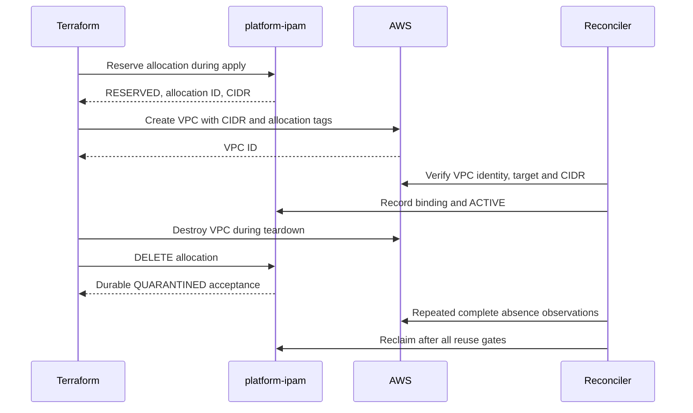

# Terraform and other AWS provisioning clients

Status: implemented local client contracts, 2026-09-08. The dedicated `platformipam` provider source is in [`providers/terraform`](../providers/terraform); it is not published to a registry. AWS is the first supported target.

## 1. Client boundary

All allocation consumers call platform-ipam. Terraform uses two providers: `platformipam` for address reservation and `hashicorp/aws` for infrastructure. A NetBox Terraform provider exists, but it manages NetBox resources directly. Restrict any such use to controlled inventory bootstrap outside the consumer allocation path, and verify compatibility with the pinned NetBox release. [NetBox provider repository](https://github.com/e-breuninger/terraform-provider-netbox).

| Client | Initial support | Lifecycle owner |
| --- | --- | --- |
| Terraform | Dedicated provider, allocation resource, read data sources | Provider reserves/quarantines; AWS provider creates/deletes resources |
| REST / curl | Documented HTTPS API | Caller persists allocation identity and coordinates AWS lifecycle |
| Supported CLI | `platform-ipam client`, shipped in the service image | Operator or pipeline coordinates reserve, provision, verify, release |
| Python automation | Example client now; generated/shared SDK after OpenAPI | Application coordinates reserve, provision, verify, release |
| AWS CLI / SDK / CDK | Consume a previously committed allocation | Provisioner passes CIDR/tags; deployment cleanup explicitly releases |
| CI runners | Invoke provider/CLI/SDK with workload credentials | Pipeline uses a stable logical key, not a run-number key |
| Ansible | `uri` integration or future collection | Playbook persists IDs and separately handles teardown |
| Pulumi | Future native provider or HTTP client integration | Must implement preview, refresh, import, and delete semantics |
| Crossplane / Kubernetes controller | Deferred until a real consumer requires it | Finalizer must obtain durable quarantine acceptance before forgetting identity |
| OpenTofu | Candidate Terraform-protocol client | Add to acceptance matrix before claiming support |

Do not build every SDK/controller in v1. Ship Terraform, REST, and the Python example first. NetBox UI remains an optional operator interface described in [NetBox integration](NETBOX_INTEGRATION.md).

## 2. Provider implementation contract

Use the Terraform Plugin Framework with an API client independent of NetBox. Required provider configuration is `endpoint`; credentials come from `PLATFORM_IPAM_TOKEN` or a planned workload credential helper. Optional token configuration, if offered, is sensitive and must never be written into resource state or diagnostics. The API owns tenant/account authorization.

| Resource attribute | Terraform schema / behavior |
| --- | --- |
| `allocation_key` | Required string; immutable |
| `scope`, `environment`, `region`, `prefix_length` | Required; immutable |
| `account_id` | Required in provider v1 to make the AWS target explicit, although REST can infer it |
| `address_family` | Optional, default `ipv4`; immutable |
| `parent_allocation_id`, `availability_zone_id` | Optional, scope-validated; immutable |
| `description`, `labels` | Optional with empty defaults; update through revision-checked PATCH |
| `id`, `cidr`, `pool_id` | Computed stable identity/result |
| `allocation_state` | Computed API `state`; asynchronously observed, never configurable |
| `bound_resource_id`, `inventory_url` | Optional computed observations; never provisioning dependencies |
| `timeouts` | Optional nested attributes: create 10m, update 5m, delete 5m by default |

Implement `platformipam_allocation` as a managed resource, and read-only data sources `platformipam_allocation` (exactly one of ID/key) and `platformipam_pool` (ID). Data sources may read only committed usable allocations for provisioning; reject QUARANTINED/RELEASED. They never reserve. GET/list/capacity and planning must not mutate inventory.

| Provider operation | API behavior and required safeguards |
| --- | --- |
| Configure / Validate / Plan | Validate configuration and read policy if needed; never POST an allocation. CIDR/ID stay unknown for new resources |
| Create | POST with stable key; persist/recover operation; poll `202`; read the committed allocation; only succeed for RESERVED/ACTIVE. Reconcile planned mutable fields through PATCH if a replay returns differing metadata |
| Read | GET by ID. Preserve ID/CIDR on upstream errors. Refresh metadata/state; a backend outage is a diagnostic, not disappearance. A `409 allocation_pending` (the owning tenant's own uncommitted hold, still `PENDING` -- [docs/API_V1.md](API_V1.md) section 5) is never treated as a `404`: state is retained exactly as for any other upstream error, and the diagnostic names the pending operation from `error.details.operation_id` instead of reporting the allocation as unproven-absent |
| Update | Change description/labels only, with current ETag and a fresh operation idempotency key. Retry an identical ambiguous PATCH with the same key; on `412`, re-read and reconcile before a new attempt |
| Delete | DELETE allocation. Success after `202` identifies the allocation as durably QUARANTINED, or `204` confirms RELEASED. Retry transient errors and child release conflicts within the deadline; preserve Terraform state on failure or ambiguous `404` unless a prior durable release receipt exists |
| Import | Import existing platform allocation ID and Read its full attributes; no reservation or cloud creation |

For stable computed values, retain known state during ordinary metadata updates. Clear computed identity/CIDR on replacement; do not copy the old CIDR into a new allocation plan. Lifecycle and binding observations can change asynchronously and must remain unknown where necessary to honor Terraform's plan/apply consistency rules. [Framework plan modification](https://developer.hashicorp.com/terraform/plugin/framework/resources/plan-modification).

Create must set the verified allocation identity in Terraform state as soon as safely known, even if a later metadata update fails. Report diagnostic details sufficient to recover by key/import when cancellation or a process crash prevents state persistence. Never return success with an uncommitted CIDR. [Framework resource creation](https://developer.hashicorp.com/terraform/plugin/framework/resources/create).

Terraform can mark a partially created resource as tainted when Create returns an error. The next apply can therefore propose replacement even without a configuration change. A failed metadata PATCH after a committed allocation must emit a recovery diagnostic: stop applies, verify the allocation ID/immutable request and cloud state, then explicitly clear taint or carefully re-import without issuing release. The next normal update reconciles metadata. Do not execute an automatic same-key destroy/create. Include this failure path in acceptance tests. [Framework Create caveats](https://developer.hashicorp.com/terraform/plugin/framework/resources/create).

An authorized `404` for a previously stored ID cannot distinguish an absent record from changed tenant authorization under the API's privacy contract. Provider Read should fail closed with a recovery diagnostic in initial v1, rather than silently recreate. For a known QUARANTINED/RELEASED record, retain identity, expose its state, and block new provisioning in plan/create. Ensure the delete-only path can finish removing a released resource. Loss of API state or manual release must not cause replacement under the same retired key.

Immutable changes require replacement **and a new allocation key**. Mark changed sizing/placement fields with replacement semantics and return a plan diagnostic if the key is unchanged. Manual `-replace` of an allocation with the same key is unsupported; use a new resource/key generation. `create_before_destroy` is valid only with distinct identities and sufficient capacity. Replacing an AWS VPC/subnet under an existing bound allocation is also unsupported in v1: create a new allocation generation and migrate consumers.

`terraform state rm` and configuration removal with state-forgetting behavior are not release operations. They leave the durable reservation intact. Document recovery and prevent the same allocation from being managed by multiple Terraform states; HTTP idempotency is not a Terraform state lock.

## 3. AWS VPC usage

The [VPC example](../examples/terraform/vpc/main.tf) supplies the requested API properties and passes the result to `aws_vpc`. AWS `allowed_account_ids` prevents the provider credentials from targeting an unintended account. Replace the custom registry placeholder with the actual distribution address, select tested Terraform/AWS-provider versions, and commit the generated provider lockfile after initialization.

Run after provider publication and API deployment, using an authorized test pool/account:

```bash
export TF_VAR_ipam_endpoint="https://ipam.stage.example.com"
export TF_VAR_aws_account_id="123456789012"
# PLATFORM_IPAM_TOKEN and AWS credentials are supplied by the identity workflow.
terraform -chdir=examples/terraform/vpc init
terraform -chdir=examples/terraform/vpc plan -out=allocation.tfplan
# Required before apply: inspect the saved plan and pass the replacement policy in section 8.
terraform -chdir=examples/terraform/vpc apply allocation.tfplan
```

Treat the account and URLs as placeholders. Select `environment` and `allocation_key` for an eligible pool. Staging can use synthetic `prod` network-policy fixtures because deployment and network environment are distinct; it must still point to isolated staging NetBox/cloud credentials.

The data dependency is:



The worker's asynchronous ACTIVE transition is not a prerequisite for creating the AWS resource, so there is no circular dependency. CI that requires verified ACTIVE polls the allocation after apply; it does not hold provider Create waiting for infrastructure that Terraform has yet to create.

The examples only create a VPC and optional subnets. Add route tables, gateways/NAT, endpoints, security controls, and workloads through the usual AWS modules as required. `aws_vpc.cidr_block` and `aws_subnet.cidr_block` accept explicit CIDRs. Do not combine those with AWS-native IPAM pool allocation arguments for the same network. [AWS provider VPC resource](https://raw.githubusercontent.com/hashicorp/terraform-provider-aws/main/website/docs/r/vpc.html.markdown), [AWS provider subnet resource](https://raw.githubusercontent.com/hashicorp/terraform-provider-aws/main/website/docs/r/subnet.html.markdown).

## 4. Subnet usage and destruction

After the subnet milestone, copy [the subnet extension](../examples/terraform/subnets/main.tf) into the VPC example directory as `subnets.tf`. Its `for_each` keys and AZ IDs are known at plan time; only allocation IDs/CIDRs are unknown. Validate AZ availability for the target account instead of assuming example AZ IDs are enabled.

Each subnet gets its own allocation key and parent allocation reference. Do not create subnets with `cidrsubnet(vpc_cidr, ...)` while expecting the service to know their child allocations; either use managed child allocations or explicitly adopt a separate subnet inventory contract.

Terraform destroys each AWS subnet before its allocation. Child allocations become QUARANTINED before the parent allocation's DELETE can run. AWS VPC deletion can occur after its AWS subnets are gone; parent allocation reclamation still waits for child records to become RELEASED. A live containing VPC is permitted during individual subnet reclamation and must not be misclassified as a peer overlap.

Production modules can add `prevent_destroy` and release approvals according to the team's infrastructure workflow. The illustrative module permits a full sandbox destroy so lifecycle tests can execute. Do not automate destroy/recreate with an unchanged retired allocation key.

## 5. Import and recovery

Provider import delegates to `ImportState`, followed by Read to populate the remaining schema. It uses platform IDs, never NetBox IDs or a CIDR that could belong to a different owner. [Framework import](https://developer.hashicorp.com/terraform/plugin/framework/resources/import).

```bash
terraform -chdir=examples/terraform/vpc import platformipam_allocation.vpc alloc_01
terraform -chdir=examples/terraform/vpc plan
```

Before import, the configuration must describe the same immutable request. Import an existing AWS VPC into `aws_vpc.orders` separately when appropriate. An inventory administrator must first register the space through onboarding import and then give it an owner through adoption (`platform-ipam adopt`, [ADR 0010](decisions/0010-ADOPTING_EXISTING_NETWORKS_AS_ALLOCATIONS.md), the [adoption runbook](../deploy/runbooks/ADOPTION.md)) before it has a platform allocation ID at all; Terraform import itself never claims an arbitrary prefix.

An adopted allocation imports exactly like any other committed allocation — adoption gives the provider nothing special to do. `ImportState` is a plain passthrough of the platform allocation ID (`resource.ImportStatePassthroughID`), followed by the same `Read` any import uses; there is no adoption-aware import path in the provider and none is planned. The one adoption-specific rule is upstream of Terraform entirely: the configuration's `prefix_length` must equal the mask length of the CIDR that was actually adopted, or the immutable request the provider computes will not match the allocation and import will refuse it as a drift, exactly as it would for a hand-edited configuration against any other allocation.

| Failure | Recovery |
| --- | --- |
| Allocation POST times out | Repeat with same logical key/request, or poll operation; never change key to bypass uncertainty |
| Allocation committed, Terraform state lost | Look up by allocation key, verify ownership and immutable fields, import ID |
| Create returned an error after recording allocation state | Inspect taint/replacement plan, verify allocation and cloud identity, then untaint or re-import without release; retry metadata update |
| AWS create succeeded but Terraform lost VPC state | Inspect the authorized account, verify CIDR/tags, import AWS resource; do not blindly retry CreateVpc |
| AWS create fails definitively | Keep reservation for retry; explicitly release only when the deployment has been abandoned |
| Platform API/ledger unavailable during refresh | Fail the operation with state retained; resume after dependency recovery |
| Allocation released out of band | Stop provisioning; investigate bindings/consumer state, then use a new allocation generation if replacement is intended |

A NetBox-only outage still permits ledger-backed Read, with pending inventory projection/freshness exposed by the API. The provider has no direct NetBox health dependency.

Private provider distribution needs a registry or approved filesystem/network mirror, release checksums/signatures, supported OS/architectures, and a compatibility policy. Keep API v1/provider versions independently versioned and retain rollback artifacts. [Terraform provider installation](https://developer.hashicorp.com/terraform/cli/plugins).

## 6. Supported CLI

`platform-ipam client` is the first-party consumer client ([ADR 0003](decisions/0003-FIRST_PARTY_CONSUMER_CLI.md)).
It ships in the service image, so it needs no separate artifact.

```bash
export PLATFORM_IPAM_URL=https://ipam.stage.example.com
export PLATFORM_IPAM_TOKEN=...

platform-ipam client reserve \
  --key prod-eu-central-1-orders \
  --scope vpc --env prod --region eu-central-1 \
  --account 123456789012 --prefix-length 20 \
  --label service=orders
```

Verbs are `reserve`, `get`, `list`, `capacity`, `bind`, `release`, `findings`,
`cancel`, and `evidence`. Output is JSON on stdout; diagnostics go to stderr.

`evidence [--scope operator|<tenant-id>] [--out PATH]` exports an
**allocation evidence file** for [`platform-ipam onboard progress
--allocations`](MIGRATION_PROGRESS.md) (ADR 0015): it walks every page of
`GET /v1/allocations` — following `next_cursor`, refusing an unreadable
payload — exactly as `findings --fail-if-open` walks its own pages, then
writes one JSON document (`read_at`, `scope`, `allocations[]`) instead of
printing each page as it arrives. `--scope` names the principal that
produced the export: `operator` is inferred automatically when every
returned row carries `tenant_id` (only an operator's own read receives that
field, ADR 0011); a tenant credential's own read carries it on no row at
all, so `--scope <tenant-id>` is **required** for a tenant export and the
command refuses (exit `2`) rather than guess which tenant it is. `--out`
additionally writes the same bytes to a path, through a temp file and an
atomic rename, so a failure partway through never leaves a truncated file.
See [Migration progress](MIGRATION_PROGRESS.md) section 5 for the full
scope rule and worked examples.

`cancel --operation-id <id>` withdraws the caller's own pending `RESERVE`
once the platform has itself declared it stuck (`DELETE
/v1/operations/{operation_id}`, [ADR 0013](decisions/0013-A_RESERVATION_THAT_CAN_NEVER_COMPLETE.md)):
refused with `409 reservation_not_stuck` unless an open `reservation_stuck`
finding names the allocation, and never for a committed allocation (release
that instead). Unlike every other verb, it prints one JSON document on
stdout for *both* outcomes: the cancel report's fields (`fenced`,
`already_fenced`, `removed`, `deleted`, `finding_resolved`, the withdrawn
`allocation` and the fenced `operation`) on success, the server's error
object on a refusal — so a script driving a cancel gets a machine-readable
reason even when it fails. When a refusal follows a fence that had already
succeeded (`cancel_uncertain`, `cancel_incomplete`, `cancel_inventory_refused`,
`cancel_state_changed`), that error object's `details` carries the same
progress fields plus `allocation_id`/`operation_id` (work-plan package H9),
so a script can tell "nothing happened yet" from "the fence is written and
the removal is what failed" without a second read; every refusal the fence
itself makes carries no such details. It needs no request body or `Idempotency-Key`:
`DELETE` is inherently idempotent, and a repeat of a cancel that already
finished converges on the same report (`already_fenced: true`, `removed:
false`, `deleted: true`) rather than refusing. Exit `0` on success or a
converged repeat, `5` for every refusal (an unknown or another tenant's
operation id, an operation that is not a pending `RESERVE`, a committed
allocation, or `reservation_not_stuck`), `2` for usage.

The CLI is a transport client only. It selects no CIDR, chooses no pool, and
sends no tenant, owner, or role — the API owns all of that, exactly as it does
for the provider. What it does own are the consumer-side obligations of this
contract:

- `--key` is required and is never generated. A key derived from a run number
  or a timestamp is the failure this system exists to prevent.
- The `Idempotency-Key` is derived from the allocation key, so a retried
  invocation is a replay rather than a second reservation.
- A `202` is polled to a terminal operation state; the reservation is never
  re-posted.
- No `cidr` is printed for an allocation that is not committed.

Exit codes distinguish outcomes a pipeline must treat differently: `0` success,
`2` usage, `3` unauthorized, `4` the operation did not settle before the
deadline, `5` an API error, `6` a transport error, `7` `findings --fail-if-open`
found an open finding, `8` `findings --fail-if-open` ran under an identity
whose tenant is eligible for no pool. Exit `4` is not a failure to retry
blindly — that allocation still owns address space, and retrying with the
same allocation key resumes the same identity.

`awaitOperation`, the polling loop `reserve` and `bind` both share, prints
the *operation itself* and exits `5` on any terminal status other than
`SUCCEEDED` (ADR 0013). It used to treat every terminal status as
success-shaped: on a `FAILED` reservation it read the operation's
`allocation_id`, found it non-empty, and issued `GET
/v1/allocations/{id}` — which, for a cancelled hold, answers `404`, so the
CLI showed the consumer a bare not-found error instead of the reason their
reservation failed. It now prints the terminal operation as-is — carrying
`error.code` (for example `reservation_cancelled`) and `error.message` — and
exits on that operation's own error, never on a synthesized one; this
applies to every `FAILED` operation `awaitOperation` polls, not only a
cancelled `RESERVE`.

The Terraform provider's behavior on a lost or ambiguous create response is
covered in [section 5](#5-import-and-recovery) below; one part of it bears
repeating here because it is easy to assume otherwise: the provider **never
cancels a reservation on its own**, not even on its own `Create` timeout
(`timeouts.create`, default 10 minutes). A provider timeout is routinely
shorter than one reconciliation interval, and cancelling on it would destroy
holds that were one worker pass away from committing; only the hold's own
tenant, over the API or the CLI, ever cancels a reservation. When `Create`'s
lookup by allocation key finds nothing to recover — including because the
hold was cancelled, by the tenant or by automation running under the same
credential — the provider's diagnostic says the request can be retried
safely under the same `allocation_key`, names `reservation_cancelled` as one
of the reasons it might have been, and states that such a retry reserves
fresh rather than replays the cancelled attempt; no Terraform state is
written either way.

`findings` reads `GET /v1/findings` and prints the full list the API returns,
unfiltered. `--fail-if-open` exits `7` when that list contains at least one
finding with status `OPEN`, so a CI pipeline can gate on drift without parsing
the JSON itself; without the flag the exit code stays `0` regardless of status. With the flag the verb follows `next_cursor` through every page and prints each page as the server sent it, one JSON document after another, because a gate that judged only the first page would pass while an open finding sat on the second. A page it cannot read, or pagination that does not end, fails the gate rather than passing it. Without the flag the verb makes exactly one request.

Before judging any finding, `--fail-if-open` first asks `GET /v1/pools`
(never printed — it is evidence for the verdict, not output) and exits `8`
instead of a clean pass if the caller's tenant is eligible for no pool. Every
read the API serves is scoped by the caller's tenant, so such an identity
always sees an empty findings list, and a clean verdict over it would prove
nothing rather than prove there is no drift. `GET /v1/pools` itself answers
this with `403 no_eligible_pool` ([ADR 0011](decisions/0011-WHAT_AN_OPERATOR_WHO_IS_NOT_A_TENANT_MAY_SEE.md)),
and the CLI treats that code, and only that code, as "not eligible"; any
other `403` is reported as an ordinary authorization failure (exit `3`) and
`/v1/findings` is never requested.

Which identity a pipeline runs the gate with changes what it judges, not
whether it can pass or fail. Run under a tenant identity, `--fail-if-open`
judges that tenant's own view: its own allocations' findings and its own copy
of every domain-level finding it is eligible to see. Run under the
`role: operator` identity ADR 0011 stage two adds, `GET /v1/findings` instead
answers across the whole estate: every domain-level finding (an occupancy
code such as `unmanaged_occupancy`, fanned out to each of a domain's eligible
tenants) is de-duplicated to one row per resource before the operator ever
sees it, so the same flag judges every resource once rather than once per
eligible tenant. Run under a tenant identity that is itself eligible for no
pool, the gate still exits `8` rather than a clean pass, because a verdict
over a list that identity cannot honestly read proves nothing; an operator
identity has no tenant to be ineligible with, and is granted `GET
/v1/pools` outright, so it never meets this refusal. A pipeline that must
catch drift anywhere in the estate, not only
in the resources one team happens to own, should run the gate with an
operator credential; a pipeline scoped to one team's own resources should
keep using that team's own tenant credential — an operator's wider view is
not a replacement for a tenant's narrower one, only a different question
asked of the same endpoint. Either way, the credential the gate runs under
can perform no write: an operator token is refused by `POST`, `PATCH`,
`PUT .../binding` and `DELETE` exactly as any principal with no tenant is, so
granting it to a pipeline widens what that pipeline can see and never what it
can change.

Origin rules match the Python example: HTTPS is required, `PLATFORM_IPAM_URL`
must be a bare origin without embedded credentials, and plaintext HTTP is
accepted only for a loopback origin with `PLATFORM_IPAM_ALLOW_LOCAL_HTTP=1`.
The bearer token is never carried across a redirect.

## 7. REST and Python examples

Reserve using the committed fixture body:

```bash
curl --fail-with-body --silent --show-error \
  -H "Authorization: Bearer ${PLATFORM_IPAM_TOKEN}" \
  -H 'Content-Type: application/json' \
  -H 'Idempotency-Key: reserve-prod-eu-central-1-orders-v1' \
  --data-binary @examples/rest/allocate.json \
  "${PLATFORM_IPAM_URL}/v1/allocations"
```

Inspect the HTTP status: `201`/`200` returns an allocation; `202` returns an operation whose SUCCEEDED result points to the allocation. Do not use an operation object as a CIDR. [The Python example](../examples/python/reserve.py) handles these branches, bounds retries, rejects cross-origin redirects, and prints the committed allocation as JSON:

```bash
python3 examples/python/reserve.py examples/rest/allocate.json > allocation.json
```

The client requires HTTPS, `PLATFORM_IPAM_URL`, and `PLATFORM_IPAM_TOKEN`. For local Compose HTTP only, explicitly set `PLATFORM_IPAM_ALLOW_LOCAL_HTTP=1`; this permits loopback origins only. Keep the allocation file as an access-controlled deployment artifact; do not place credentials in it. The client is illustrative and is not a replacement for the future generated SDK.

For cleanup, first delete the owned AWS resources and stop pending provisioning, then submit DELETE for the allocation ID. Read state/quarantine blockers afterwards. A successful DELETE acknowledges quarantine, not immediate address availability.

## 8. AWS CLI, SDK, CDK, and CI integration

An AWS CLI consumer follows reserve → validate allocation → provision → verify. This command assumes `allocation.json` is a committed usable allocation whose target account/region were checked against the active AWS credentials:

```bash
ipam_cidr=$(jq -er '.cidr' allocation.json)
ipam_id=$(jq -er '.id' allocation.json)
ipam_key=$(jq -er '.allocation_key' allocation.json)
ipam_region=$(jq -er '.region' allocation.json)
ipam_tags=$(jq -cn --arg id "$ipam_id" --arg key "$ipam_key" \
  '[{ResourceType:"vpc",Tags:[{Key:"platform-ipam:allocation-id",Value:$id},{Key:"platform-ipam:allocation-key",Value:$key}]}]')

aws ec2 create-vpc --region "$ipam_region" --cidr-block "$ipam_cidr" \
  --tag-specifications "$ipam_tags"
```

This is a provisioning illustration, not an idempotent AWS wrapper. A lost AWS create response must be resolved by inventory inspection before retry; the platform API's idempotency does not make cloud commands idempotent. Submit the resulting VPC ID to the binding endpoint or wait for tag-based discovery. The [AWS integration plan](AWS_INTEGRATION.md) defines the trusted observation/identity checks.

For Python/Boto3 or Go AWS SDK callers, use the same tags and persist both allocation ID and AWS ID in the workflow's durable state. CDK/CloudFormation should consume an allocation created in an explicit deployment step; avoid reserving during synth, diff, or template evaluation. A future custom resource would need durable retry identity and delete handling and is outside v1.

CI uses a stable service/environment/region/generation allocation key across retries. Serialize runs for the same Terraform state, protect its backend, use short-lived AWS and platform credentials, and store recoverable operation/resource IDs. A new CI run number is not a new allocation identity. A failed workflow never releases in an unconditional `finally` block because cloud infrastructure may already exist.

Before applying a saved plan, run a mandatory policy check of `terraform show -json`: for every `platformipam_allocation` change whose actions include both create and delete, require a known new `allocation_key` different from the old one. Reject an unchanged or unknown replacement key, including taint-driven and `-replace` changes. The provider's immutable-field diagnostics alone cannot guard all Terraform-core replacement causes. Consumer CI/modules must ship this guard alongside the provider, and local recovery instructions must make the same check. Direct deliberate CLI bypass remains outside this operating guarantee.

After independent verification, a recovery command can be `terraform -chdir=examples/terraform/vpc untaint platformipam_allocation.vpc`, followed by a new inspected plan. Untaint only removes Terraform's taint marker; it does not repair remote state. [Terraform untaint](https://developer.hashicorp.com/terraform/cli/commands/untaint), [Terraform plan JSON](https://developer.hashicorp.com/terraform/internals/json-format).

An Ansible `uri` caller can use the same JSON body and headers and treat `[200, 201, 202]` as protocol successes, then poll the operation/allocation. Check mode must remain read-only. Reserve/release steps need persisted identities and explicit AWS teardown; `changed_when` alone does not implement lifecycle safety.
