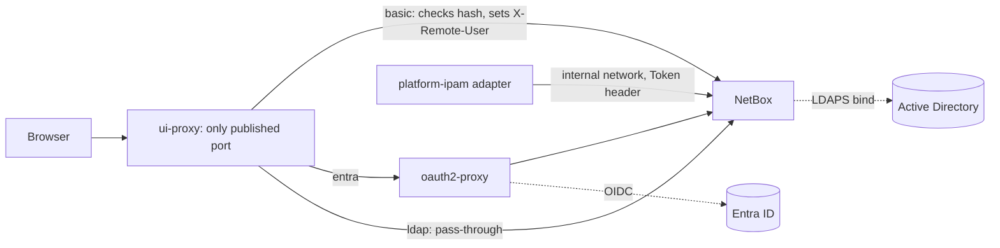

# Operator UI authentication

Status: implemented and locally verified, 2026-09-18. `basic` mode (packages
A2, A3, A6) is wired and tested against the real Compose stack: 6 tests in
`tests/e2e/test_e2e_ui_proxy.py` (A3, one of them package T2's e2e quota
canary) plus 14 tests and 5 guard-removal mutations in
`tests/e2e/test_e2e_ui_auth.py` (A6), both run automatically by
`./tests/e2e/run-e2e.sh`, and an opt-in browser check
(`tests/e2e/browser_smoke.py`). `entra` mode (package A4) and `ldap` mode
(package A5) are implemented as optional Compose overlays; `entra` is
verified against a **mock OIDC issuer only**, `ldap` against an
**OpenLDAP-compatible test server only** -- **neither has been run against a
real Microsoft Entra ID tenant or a real Active Directory.** An optional
`ui-proxy` also exists in the Helm chart (package A7, `basic` mode only,
disabled by default); it is verified by `helm lint`/`helm template` and by
running its rendered Caddyfile under the pod's exact security constraints --
**not against a running cluster.** TLS termination outside loopback (ADR
0006 rule 7) is unverified everywhere: every local run stays inside the
Compose network's plaintext or (Helm) a template render. Section 1 is the
audit that motivated this work; section 2 is the design packages A1-A9 built
against; the sections after it describe what each package actually shipped.
Decision record: [ADR 0006](decisions/0006-OPERATOR_UI_AUTHENTICATION.md).

## 1. Audit: what existed before this work

This table describes the repository as it was before packages A1-A9; it is
preserved as the evidence that motivated the design in section 2, not a
running account of today's state. Where a finding has since been addressed,
the section that addressed it is named.

| Finding | Evidence | Severity | Addressed by |
| --- | --- | --- | --- |
| The only web UI is NetBox. platform-ipam serves JSON only: 13 routes, no HTML, no static mount | `internal/transport/http.go:46-77`; `docs/NETBOX_INTEGRATION.md:9` forbids mounting a frontend into the API | informational | unchanged; see [ADR 0008](decisions/0008-PLATFORM_OWNED_OPERATOR_UI.md) |
| The platform API accepts `Bearer` only. `Basic` is rejected at the scheme gate and no `WWW-Authenticate` is ever sent | `internal/transport/auth.go:57-63` | correct, keep | unchanged |
| Login is enforced: the image defaults `LOGIN_REQUIRED` to `True`, so the UI is **not** anonymously readable. (An earlier draft of this audit said it was; that was wrong.) The setting is deprecated and disappears in NetBox 5.0 | image `configuration.py:251`, NetBox `settings.py:158` | correct, keep | unchanged |
| No `REMOTE_AUTH_*`, LDAP, SAML or social-auth settings exist | `deploy/compose/netbox/netbox.env` | gap | A3 (`basic`), A4 (`entra`), A5 (`ldap`) |
| `CORS_ORIGIN_ALLOW_ALL=True` | `deploy/compose/netbox/netbox.env:3` | medium | A3 -- removed |
| One bootstrapped superuser is the only human login; no groups, no object permissions, no read-only role | `deploy/compose/netbox/bootstrap-token.py:44-49` | high | A2 |
| The loopback port binding is the only access control on the UI | `deploy/compose/compose.netbox.yaml:22-23` | high outside a laptop | A3 -- NetBox's port is no longer published at all; `ui-proxy` is |
| No reverse proxy is shipped or referenced | repo-wide search; only `ingress-nginx` label selectors in Helm values | gap | A3 |
| The Helm chart exposes the API only. NetBox has no ingress, service or values; stage/prod NetBox is assumed to be another team's release | `deploy/helm/platform-ipam/templates/ingress.yaml`, `docs/DEPLOYMENT.md` | gap | A7 -- optional `uiProxy`, `basic` mode only; NetBox itself is still not deployed by this chart |
| `values.schema.json` is closed (`additionalProperties: false`, `auth.mode` enum `oidc\|local`) | `deploy/helm/platform-ipam/values.schema.json:31-34` | constraint | unchanged (`auth.mode` is the platform API's own identity, a separate concern from `uiProxy`) |
| NetworkPolicy egress defaults to `[]`; an LDAP or Entra endpoint is unreachable until allowed | `deploy/helm/platform-ipam/values.yaml:92` | constraint | A7 adds `uiProxy.networkPolicy.egress`, still empty by default |
| `domain.Principal` had no role field, so "read-only operator" could not be expressed in the platform identity file. Package G3b1 added `Role`, but only for the platform *API* -- a bearer-token caller in the identity file, never a browser session against this NetBox UI; the two operator populations remain unreconciled (see ADR 0011's Consequences) | `internal/domain/types.go` | constraint for an own UI | unchanged for this UI; see [ADR 0008](decisions/0008-PLATFORM_OWNED_OPERATOR_UI.md) and [ADR 0011](decisions/0011-WHAT_AN_OPERATOR_WHO_IS_NOT_A_TENANT_MAY_SEE.md) |
| The docs already require SSO and read-only operator roles (phase U1) but none of it is built | `docs/NETBOX_INTEGRATION.md:74-85`, `docs/IMPLEMENTATION_PLAN.md:193` | gap | A2 (read-only groups exist in the development bootstrap); production SSO against a real identity provider is still onboarding work |

The platform API needs no change. Basic auth on a machine API that already has bearer tokens would only add a weaker credential; the target is the browser path to NetBox.

## 2. Design: one proxy, one trust model, three modes

A small reverse proxy, `ui-proxy`, is the only published path to the NetBox UI. The design called for one variable to select how a person proves who they are:

```
NETBOX_UI_AUTH_MODE = basic | entra | ldap
```

**Shipped reality differs from that design.** No file in this repository sets or reads `NETBOX_UI_AUTH_MODE` -- it is design-stage text only, still present in this document and in [ADR 0006](decisions/0006-OPERATOR_UI_AUTHENTICATION.md)'s Decision. The mode is instead selected by which Compose overlay is layered on top of `compose.netbox.yaml`: no overlay is `basic` mode (`deploy/compose/ui-proxy/Caddyfile` and `netbox.env`'s `REMOTE_AUTH_*` settings, unchanged); `-f compose.ui-entra.yaml` is `entra` mode; `-f compose.ui-ldap.yaml` is `ldap` mode. This is a deliberate deviation, not an oversight: each mode needs NetBox configured differently -- `ldap` mode in particular needs `REMOTE_AUTH_ENABLED=false` where `basic` and `entra` need it `true` -- and an overlay leaves the shared `compose.netbox.yaml` / `netbox.env` / `ui-proxy/Caddyfile` files `basic` mode already uses untouched, so the three modes never fight over the same service definition or get combined by accident. The Helm chart (package A7, section 8 below) follows the same idea one step further: it only implements the `basic`-mode Caddyfile today, and its `uiProxy.mode` values-schema enum is `["basic"]` only.

| Mode | When | Who checks the password | How NetBox learns the user |
| --- | --- | --- | --- |
| `basic` | Fallback when no identity provider is connected | `ui-proxy` (bcrypt hashes) | trusted `X-Remote-User` header |
| `entra` | Microsoft Entra ID tenant available | Entra ID, through `oauth2-proxy` behind `ui-proxy` (locally, a mock OIDC issuer stands in for Entra ID -- section 3) | trusted `X-Remote-User` header |
| `ldap` | On-premises Active Directory reachable over LDAPS | NetBox itself (its LDAP backend binds to AD) | NetBox login form; proxy only routes |



Rules that hold in every mode:

1. **NetBox's own port is never published.** Header trust is only safe when the proxy is the sole way in. In Compose the `ports:` entry moves from `netbox` to `ui-proxy`, in every mode's overlay alike.
2. **The proxy deletes any client-supplied `X-Remote-User` / group header before authenticating**, then sets its own. A spoofed header must never reach NetBox. In `basic` and `entra` mode this delete step is defense in depth, not the sole guard: the proxy's final directive -- `request_header X-Remote-User {http.auth.user.id}` in `basic` mode, `copy_headers { X-Auth-Request-User>X-Remote-User }` after `forward_auth` in `entra` mode -- overwrites whatever the client sent regardless, so a forged header would be clobbered even if the earlier strip were removed (confirmed by package A6's guard-removal mutation testing). In `ldap` mode the strip is the *only* guard on this header, because NetBox never trusts it there at all (`REMOTE_AUTH_ENABLED=false` -- see the settings table below).
3. **The proxy serves browsers only.** It refuses `/api/` and `/graphql/`. HTTP Basic and NetBox's `Authorization: Token` both use the `Authorization` header, so they cannot share a path. The platform adapter keeps using the internal address (`http://netbox:8080`) and never crosses the proxy. A path-matrix parameter (`/api;x=1/...`) is not matched by a plain `path /api/*` glob -- Go's URL parser does not treat `;` specially, so the first path segment becomes literally `api;x=1` -- and package A6's bypass tests found it reaching NetBox with a valid credential. All three Caddyfiles (`basic`, `entra`, `ldap`) and the Helm chart's rendered Caddyfile now carry a second matcher, a case-insensitive `path_regexp (?i)^/+(api|graphql);`, that refuses it outright.
4. **Login stays enforced and CORS is closed.** `LOGIN_REQUIRED` is already `True` by default and is deprecated, so it is left unset; the `CORS_ORIGIN_ALLOW_ALL=True` override in `netbox.env` is removed.
5. **Every authenticated person lands in a read-only group.** Remote users are auto-created into `platform-operators` (view permissions on IPAM objects only). Write access is a separate, explicitly granted group; the platform service account stays the only routine writer, as `docs/NETBOX_INTEGRATION.md:74` requires.
6. **The local superuser remains as break-glass**, reachable only from inside the network, never through the proxy in `basic` or `entra` mode. In `ldap` mode the proxy does pass NetBox's own login form through (it authenticates no one itself), so the superuser can still sign in there with a plain NetBox password -- through `ObjectPermissionBackend`, which stays in `AUTHENTICATION_BACKENDS` regardless of mode (see the "Header trust is off in this mode" note under LDAP mode, section 6).
7. Outside loopback the proxy terminates TLS. Basic credentials over plaintext are refused by configuration, not by convention.

NetBox settings per mode, corrected against the overlays and `netbox.env` that actually ship (not the earlier design guess):

| Setting | `basic` | `entra` | `ldap` |
| --- | --- | --- | --- |
| `REMOTE_AUTH_ENABLED` | true | true | **false** -- `ldap` mode authenticates through NetBox's own `LDAPBackend`, not the header path; `RemoteUserMiddleware` short-circuits entirely when this is false |
| `REMOTE_AUTH_BACKEND` | `netbox.authentication.RemoteUserBackend` | same (the overlay does not override `netbox`'s environment; `netbox.env`'s value applies unchanged) | `netbox.authentication.LDAPBackend` **only** -- narrowed so `RemoteUserBackend` drops out of `AUTHENTICATION_BACKENDS` too, an independent second way header trust is turned off |
| `REMOTE_AUTH_HEADER` | `HTTP_X_REMOTE_USER` | `HTTP_X_REMOTE_USER` (unchanged -- the identical header name in both modes is the point of routing `entra` through `oauth2-proxy`) | n/a (`REMOTE_AUTH_ENABLED=false`) |
| `REMOTE_AUTH_AUTO_CREATE_USER` | true | true (unset; inherits `netbox.env`) | **false** -- LDAP's own bind creates/updates the user |
| `REMOTE_AUTH_DEFAULT_GROUPS` | `platform-operators` | `platform-operators` (unset; inherits `netbox.env`) | empty -- groups come from `AUTH_LDAP_MIRROR_GROUPS` instead, never from this setting |
| Group sync | none | **none** -- `REMOTE_AUTH_GROUP_SYNC_ENABLED` is deliberately left at its default `False`; admission is gated one layer earlier, at `oauth2-proxy`'s `--allowed-group`, and every admitted user lands in `platform-operators` only, via the same `REMOTE_AUTH_DEFAULT_GROUPS` `basic` mode already sets | `AUTH_LDAP_MIRROR_GROUPS=true` mirrors the user's LDAP group memberships onto NetBox groups of the identical name; `AUTH_LDAP_REQUIRE_GROUP_DN` refuses login outright to anyone outside the required group |

Why `oauth2-proxy` for Entra rather than NetBox's built-in social login: it keeps `basic` and `entra` on the identical header-trust path, so one NetBox configuration and one set of security tests cover both. NetBox-native Entra login stays a documented alternative for an operator who already runs NetBox that way.

### Verified in image (A1)

Read from files inside `docker.io/netboxcommunity/netbox:v4.6.7-5.0.2` on 2026-09-18. `C` is `/etc/netbox/config/configuration.py`, `L` is `/etc/netbox/config/ldap/ldap_config.py`. The first pass of this table, produced by a small model, had the right names and wrong line numbers throughout; every citation below was re-read by the reviewer.

| Setting | Evidence | Default in image | Note |
| --- | --- | --- | --- |
| `LOGIN_REQUIRED` | `C:251`; NetBox core `settings.py:158,271-279` | **`True`** | Deprecated in this release and removed in NetBox 5.0. Do not set it; login is already enforced |
| `CORS_ORIGIN_ALLOW_ALL` | `C:183` | `False` | The repository overrides this to `True` in `netbox.env:3`; remove the override |
| `CORS_ORIGIN_WHITELIST`, `CORS_ORIGIN_REGEX_WHITELIST` | `C:184-185` | `https://localhost`, empty | space-separated |
| `REMOTE_AUTH_ENABLED` | `C:319` | `False` | |
| `REMOTE_AUTH_BACKEND` | `C:316` | `netbox.authentication.RemoteUserBackend` | parsed as a **list**, so more than one backend can be active |
| `REMOTE_AUTH_HEADER` | `C:323` | `HTTP_REMOTE_USER` | set to `HTTP_X_REMOTE_USER` for this design |
| `REMOTE_AUTH_AUTO_CREATE_USER` | `C:315` | `False` | |
| `REMOTE_AUTH_AUTO_CREATE_GROUPS` | `C:314` | `False` | keep `False`: groups come from the bootstrap, not from a header |
| `REMOTE_AUTH_DEFAULT_GROUPS` | `C:317` | empty | space-separated list |
| `REMOTE_AUTH_DEFAULT_PERMISSIONS` | `C:318` (comment) | -- | a dict; cannot be set by environment, only in `extra.py`. Not needed: permissions come from the group |
| `REMOTE_AUTH_GROUP_SYNC_ENABLED`, `_GROUP_HEADER`, `_GROUP_SEPARATOR` | `C:322`, `C:320`, `C:321` | `False`, `HTTP_REMOTE_USER_GROUP`, `\|` | |
| `REMOTE_AUTH_SUPERUSER_GROUPS`, `_SUPERUSERS`, `_STAFF_GROUPS`, `_STAFF_USERS` | `C:327-330` | empty | leave empty: no header may grant superuser |
| `REMOTE_AUTH_USER_EMAIL`, `_FIRST_NAME`, `_LAST_NAME` | `C:324-326` | `HTTP_REMOTE_USER_*` | |
| List parsing | `C:50` | -- | every list variable is split on a single space |
| `AUTH_LDAP_SERVER_URI` | `L:27` | none | |
| `AUTH_LDAP_BIND_DN`, `AUTH_LDAP_BIND_PASSWORD` | `L:38-39` | none | password also readable from secret file `auth_ldap_bind_password` |
| `AUTH_LDAP_BIND_AS_AUTHENTICATING_USER`, `AUTH_LDAP_USER_DN_TEMPLATE` | `L:34`, `L:42` | | |
| `AUTH_LDAP_START_TLS`, `LDAP_IGNORE_CERT_ERRORS`, `LDAP_CA_CERT_DIR`, `LDAP_CA_CERT_FILE` | `L:45`, `L:50`, `L:55`, `L:60` | | certificate settings use the `LDAP_` prefix, not `AUTH_LDAP_` |
| `AUTH_LDAP_USER_SEARCH_BASEDN`, `_ATTR`, `_FILTER` | `L:62-66` | attr `sAMAccountName` | the Active Directory default; an OpenLDAP test server needs `uid` |
| `AUTH_LDAP_GROUP_SEARCH_BASEDN`, `_CLASS`, `AUTH_LDAP_GROUP_TYPE` | `L:75-76`, `L:84` | class `group`, type `GroupOfNamesType` | nested AD groups need a different group type; not verified |
| `AUTH_LDAP_REQUIRE_GROUP_DN` | `L:87` | none | the variable ends in `_DN`; the Django setting it fills is `AUTH_LDAP_REQUIRE_GROUP` |
| `AUTH_LDAP_IS_ADMIN_DN`, `AUTH_LDAP_IS_SUPERUSER_DN` | `L:95-96` | none | leave unset |
| `AUTH_LDAP_FIND_GROUP_PERMS`, `_MIRROR_GROUPS`, `_CACHE_TIMEOUT` | `L:100-101`, `L:104` | | `MIRROR_GROUPS` maps AD groups to NetBox groups |

Installed in the image's virtualenv: `django_auth_ldap` 5.3.0, `social_auth_core` 4.8.7, `social_auth_app_django` 5.9.0, and `python-ldap`. LDAP support is present, so package A5 stands as planned. Extra configuration files in `/etc/netbox/config/` (`extra.py`, `plugins.py`) are picked up by `read_configurations()` in NetBox's `configuration.py:28`.

Not verified here: any behaviour. This table establishes names and defaults only; whether NetBox honours the header as designed is package A3's test.

## 3. What can and cannot be verified locally

| Mode | Local verification | Still required at onboarding |
| --- | --- | --- |
| `basic` | Full, against the real Compose stack: 6 tests in `test_e2e_ui_proxy.py` (A3, plus package T2's e2e quota canary), 14 tests plus 5 guard-removal mutations in `test_e2e_ui_auth.py` (A6), and an opt-in browser check (`browser_smoke.py`, a real login through `ui-proxy`'s HTTP Basic) | TLS certificate and secret handling in the target environment |
| `entra` | Wiring only, against a **mock OIDC issuer** (`navikt/mock-oauth2-server`) standing in for Entra ID, in `tests/e2e/ui_mode_entra.py` via `tests/e2e/run-ui-entra.sh` | A real Microsoft Entra ID tenant: app registration, redirect URI, real group claims (object IDs), conditional access, MFA, token overage behaviour |
| `ldap` | Wiring only, against an **OpenLDAP-compatible test server** (`osixia/openldap`) standing in for Active Directory, in `tests/e2e/ui_mode_ldap.py` via `tests/e2e/run-ui-ldap.sh` | Real AD behaviour: `sAMAccountName`, nested groups, LDAPS CA chain, service-account lockout policy |
| Helm `uiProxy` | Wiring only: `helm lint --strict` and `helm template` for stage and prod, both with `uiProxy` at its default (disabled) and, additively, enabled through a CI-only values overlay; plus running the chart's rendered Caddyfile under the pod's exact security constraints (read-only root filesystem, UID/GID 10001, `drop: [ALL]` + `NET_BIND_SERVICE`, no privilege escalation) | An actual Kubernetes cluster -- `scripts/ai/checks.py`'s `helm()` check reports `cluster-verification: NOT_CHECKED` explicitly |

A green local run in `entra` or `ldap` mode, or a green Helm lint/render, proves the wiring, not the integration with Microsoft, a real directory, or a running cluster. The work plan and this document keep those claims separate.

## 4. Known limits

- HTTP Basic has no logout and sends the credential on every request. It is the fallback, not the target state.
- `basic` users are a static list rendered from configuration. There is no self-service and no password rotation workflow.
- A NetBox administrator always outranks a viewer (`docs/NETBOX_INTEGRATION.md:89`). This design controls who gets in and with what default role; it does not constrain a NetBox admin.
- This pinned NetBox version's `User` model (`AbstractBaseUser, PermissionsMixin`, not Django's `AbstractUser`) has no `is_staff` field at all, in any mode, and its REST/GraphQL user APIs never serialize `is_superuser` back -- though it **is** filterable, via `?is_superuser=true`, and that filter is what `basic` and `entra` mode's tests use to confirm no header or group grants it; `ldap` mode's tests check the same property directly through NetBox's ORM instead. See sections 5-7 for how each suite works around this.
- The Helm chart does not deploy NetBox. Package A7 adds an optional `ui-proxy` to the chart, but only `basic` mode -- `uiProxy.mode`'s schema enum is `["basic"]` only, and `entra`/`ldap` are not yet built for Helm. The requirement that NetBox be reachable only through the proxy must still be met by whoever operates that external NetBox; this chart cannot enforce it.

## 5. Basic mode (packages A2, A3, A6)

The fallback mode, and the one that needs no overlay: `docker compose -f compose.yaml -f compose.netbox.yaml up -d` (`deploy/compose/README.md`) is already `basic` mode. `ui-proxy` (`deploy/compose/ui-proxy/Caddyfile`, started by `deploy/compose/ui-proxy/entrypoint.sh`) hashes the plaintext `NETBOX_UI_PASSWORD` from `.env` into a bcrypt hash at container start and verifies it with `basic_auth`; `deploy/compose/netbox/netbox.env` sets `REMOTE_AUTH_ENABLED=true`, `REMOTE_AUTH_HEADER=HTTP_X_REMOTE_USER`, `REMOTE_AUTH_AUTO_CREATE_USER=true`, `REMOTE_AUTH_DEFAULT_GROUPS=platform-operators`; `deploy/compose/netbox/bootstrap-groups.py` creates the `platform-operators` (view-only) and `platform-inventory-maintainers` (view + add + change on prefixes and IP ranges only) groups every mode relies on.

Verified: `tests/e2e/test_e2e_ui_proxy.py` (package A3, 6 tests -- no credential, a forged header without a credential, a valid credential, a forged header *with* a valid credential, the `/api/` block, and package T2's e2e quota canary, the suite's own last test) and `tests/e2e/test_e2e_ui_auth.py` (package A6, 14 tests plus 5 guard-removal mutations -- the fuller matrix: wrong/unknown credential, both header spellings, the forged group header, write-permission enforcement through the UI form itself, `/api/`+`/graphql/` bypass attempts including `/api;x=1/...`, the healthcheck leaking nothing, and NetBox's port never being published) both run automatically in `./tests/e2e/run-e2e.sh`'s default suite, against the real, shared `platform-ipam-dev` stack. `tests/e2e/browser_smoke.py` (opt-in, `IPAM_E2E_BROWSER=1`) additionally proves a real Chromium browser, authenticated with `NETBOX_UI_USER`/`NETBOX_UI_PASSWORD`, can find and render an allocation through the proxy.

Still required at onboarding: TLS termination outside loopback (ADR 0006 rule 7 -- every local run stays inside the Compose network, in plaintext); rotating `NETBOX_UI_PASSWORD` in a real deployment's secret store rather than a single shared `.env` value; and, if the static user list ever needs more than one person, a real secret-management story beyond that.

## 6. LDAP mode (package A5)

Status: wired and locally verified against an OpenLDAP-compatible test server; **not verified against Active Directory.**

### Starting it

`ldap` mode ships as an optional overlay, `deploy/compose/compose.ui-ldap.yaml`, never as edits to the shared `compose.netbox.yaml`, `netbox.env` or `ui-proxy/Caddyfile` (those stay `basic` mode's files, unchanged, so the two modes never fight over the same service definition). Layer it after `compose.netbox.yaml`:

```sh
docker compose --env-file .env \
  -f compose.yaml -f compose.netbox.yaml -f compose.ui-ldap.yaml \
  up -d netbox-db netbox-redis netbox-redis-cache netbox ui-proxy openldap
```

then bootstrap the NetBox operator groups exactly as in `basic` mode (`docker compose ... --profile bootstrap run --rm netbox-bootstrap`) -- `deploy/compose/netbox/bootstrap-groups.py` has no LDAP-specific behaviour; it only needs to run once before anyone logs in.

The overlay adds one more service, `openldap` (`osixia/openldap:1.5.0`, seeded from `deploy/compose/openldap/bootstrap.ldif`), and overrides two existing ones: `netbox` (the `AUTH_LDAP_*`/`REMOTE_AUTH_*` environment shown in `compose.ui-ldap.yaml`'s comments) and `ui-proxy` (`Caddyfile.ldap` and `entrypoint-ldap.sh`, which drop the `basic_auth` directive and the bcrypt-hash step entirely -- in this mode the proxy authenticates no one). `tests/e2e/run-ui-ldap.sh` runs the whole thing, isolated in its own throw-away Compose project (`platform-ipam-a5`), and tears it down (`down -v`) whether the tests pass or fail; it never touches the shared `platform-ipam-dev` project.

### Group mapping, and why it needs no custom NetBox code

`AUTH_LDAP_MIRROR_GROUPS=true` copies a user's LDAP group memberships onto NetBox `Group` objects of the same **name**. It does not translate names. The test directory's two groups are therefore named *exactly* `platform-operators` and `platform-inventory-maintainers` -- the same names `bootstrap-groups.py` already creates in NetBox with their `ObjectPermission`s attached -- so mirroring does nothing more than add the authenticated user to a NetBox group that already carries the right permissions. No `AUTH_LDAP_USER_FLAGS_BY_GROUP` rule, no plugin, no code in this repository maps one name to another.

A real Active Directory will almost never have groups named `platform-operators` / `platform-inventory-maintainers` already. Two ways to close that gap, neither requiring NetBox code:

1. **Name (or rename) the AD groups to match.** Simplest, and the only option verified here (the test directory *is* this case). Ask whoever owns the domain to create or rename two security groups to those exact names, or scope this NetBox's `AUTH_LDAP_GROUP_SEARCH_FILTER`/`AUTH_LDAP_GROUP_SEARCH_BASEDN` to an OU where that renaming has already happened.
2. **Translate names via the image's `extra.py` hook**, mounted the same way `ldap_config.py` documents (`/etc/netbox/config/ldap/extra.py`, loaded after `ldap_config.py` and overwriting anything it set -- confirmed by reading that file inside the pinned image; its own commented-out example shows exactly this pattern). For example, to require membership in one of several real AD group DNs and mirror only a curated set of NetBox-facing names:

   ```python
   from django_auth_ldap.config import LDAPGroupQuery

   AUTH_LDAP_REQUIRE_GROUP = (
       LDAPGroupQuery("CN=IPAM-Operators,OU=Groups,DC=corp,DC=example,DC=com")
       | LDAPGroupQuery("CN=IPAM-Maintainers,OU=Groups,DC=corp,DC=example,DC=com")
   )
   AUTH_LDAP_MIRROR_GROUPS = ["IPAM-Operators", "IPAM-Maintainers"]
   ```

   This still mirrors AD group *names* as-is (`AUTH_LDAP_MIRROR_GROUPS` here is a curated list, not a rename map -- `extra.py`'s own commented example in the image confirms the same), so `bootstrap-groups.py`'s NetBox groups would additionally need to be created under those AD names, or a NetBox `Group` alias/rename would be needed; this repository does not implement that translation and it was not built or tested.

In either case, no LDAP group may grant `is_staff` or `is_superuser` (see below) -- that stays a NetBox-side administrative action, never a directory membership.

### No LDAP group can grant superuser or staff

`AUTH_LDAP_IS_ADMIN_DN` and `AUTH_LDAP_IS_SUPERUSER_DN` are deliberately left unset. Reading the pinned image's `/etc/netbox/config/ldap/ldap_config.py`: once `AUTH_LDAP_REQUIRE_GROUP_DN` is set (it is, to `platform-operators`'s DN), the script always builds

```python
AUTH_LDAP_USER_FLAGS_BY_GROUP = {
    "is_active": environ.get('AUTH_LDAP_REQUIRE_GROUP_DN', ''),
    "is_staff": environ.get('AUTH_LDAP_IS_ADMIN_DN', ''),
    "is_superuser": environ.get('AUTH_LDAP_IS_SUPERUSER_DN', ''),
}
```

Left unset, `is_staff`/`is_superuser` are populated with `''` -- a DN no real LDAP entry can ever equal -- so no group membership can satisfy either flag. In this pinned NetBox version, `is_staff` goes further still: reading `users/models/users.py:113`, `User(AbstractBaseUser, PermissionsMixin)` -- not Django's `AbstractUser` -- has no `is_staff` field at all (confirmed empirically: `user.is_staff` raises `AttributeError`), so django-auth-ldap setting that key is a harmless, unpersisted attribute assignment on an in-memory object; `is_superuser` is the only elevation flag this NetBox version has. `tests/e2e/run-ui-ldap.sh` checks `is_superuser` for `viewer` and `maintainer` directly through NetBox's ORM after `tests/e2e/ui_mode_ldap.py`'s suite passes -- the REST and GraphQL user APIs expose neither flag (confirmed empirically, presumably so a read-only API caller cannot enumerate admin accounts).

### Header trust is off in this mode

Two independent settings turn off the header trust `basic` mode relies on, so a stale or copy-pasted `basic`-mode setting can never leak into `ldap` mode:

- `REMOTE_AUTH_ENABLED=false`. Reading the pinned image's `netbox/middleware.py:156`, `RemoteUserMiddleware.__call__` returns immediately -- before it ever looks at a header -- when this is `False`. No header, forged or genuine, reaches an authentication attempt.
- `REMOTE_AUTH_BACKEND=netbox.authentication.LDAPBackend` (only). Reading `netbox/settings.py:581-584`, `AUTHENTICATION_BACKENDS = [*REMOTE_AUTH_BACKEND, 'netbox.authentication.ObjectPermissionBackend']`: narrowing `REMOTE_AUTH_BACKEND` to just `LDAPBackend` drops `RemoteUserBackend` out of the list entirely, so even if the middleware above were somehow active, there would be no backend left that trusts its header. `ObjectPermissionBackend` (`netbox/authentication/__init__.py:166`) is always present regardless and is what still lets the local break-glass superuser log in with a plain NetBox password (ADR 0006: "the local superuser remains as break-glass") -- through the proxy in this mode specifically, since `Caddyfile.ldap` never authenticates anyone itself and simply passes NetBox's own login form through.

`ui-proxy`'s `Caddyfile.ldap` still strips `X-Remote-User`/`X-Remote-User-Group` (both spellings) as defense in depth, even though NetBox no longer consults them.

### A real Active Directory

Not built, not tested -- only these settings are noted for whoever onboards a real domain:

| Setting | For a real AD |
| --- | --- |
| `AUTH_LDAP_SERVER_URI` | `ldaps://` (not `ldap://`), pointed at the domain controllers, port 636 |
| `AUTH_LDAP_BIND_DN` / `_BIND_PASSWORD` | a dedicated read-only service account, not a domain admin; `AUTH_LDAP_BIND_PASSWORD` also accepts a secret file at `/run/secrets/auth_ldap_bind_password` (read in `ldap_config.py:16`), which is the preferred path outside Compose |
| `AUTH_LDAP_USER_SEARCH_ATTR` | `sAMAccountName` -- the image's own default (`docs/GUI_AUTHENTICATION.md` "Verified in image" table); unlike this overlay, a real AD needs no override here |
| `AUTH_LDAP_GROUP_SEARCH_CLASS` | `group` -- again the image's own AD-oriented default; unlike this overlay, leave unset |
| `AUTH_LDAP_GROUP_TYPE` | For groups nested inside other groups (common in AD), `NestedActiveDirectoryGroupType` rather than this overlay's `GroupOfNamesType`. **Confirmed accepted**: the image's `_import_group_type()` does `getattr(django_auth_ldap.config, name)()`, and `NestedActiveDirectoryGroupType` is present in the image's installed `django-auth-ldap` 5.3.0 (`python -c "import django_auth_ldap.config as c; print(hasattr(c,'NestedActiveDirectoryGroupType'))"` inside the pinned image prints `True`). Its *behaviour* against a real nested-group AD tree was not exercised -- this test directory has no nested groups to prove it against. |
| `LDAP_CA_CERT_FILE` (not `AUTH_LDAP_*` -- certificate settings use the bare `LDAP_` prefix, per the "Verified in image" table) | mount the domain's CA bundle read-only into the NetBox container and point this at its path, e.g. `/etc/ssl/certs/corp-ca.pem` |
| NetworkPolicy egress | `deploy/helm/platform-ipam/values.yaml` defaults NetworkPolicy egress to `[]` (section 1 audit); a Kubernetes NetBox reaching real domain controllers over LDAPS needs an explicit egress rule to them, which package A7's optional `ui-proxy` chart block does not add on NetBox's behalf -- whoever operates that NetBox must add it, the same way ADR 0006 already leaves "NetBox reachable only through the proxy" to them |

**Additional local Samba AD gate (LS1).** The opt-in
`compose.ui-samba-ad.yaml` overlay uses a pinned Samba AD container with
`sAMAccountName`, a group nested inside `platform-operators`, and LDAPS.
`tests/e2e/run-ui-samba-ad.sh up|wait|bootstrap|test|stop` runs the seven
LDAP UI tests against that domain, checks both users are not superusers,
and proves the generated CA is required for an LDAPS bind. On 2026-09-23 all
checks passed, and the AD users survived a container recreate after both
`/etc/samba` and `/var/lib/samba` were persisted. The Samba container needs
privileged mode for its filesystem extended attributes. This is a local AD
protocol test; Windows AD, an enterprise CA and domain policy remain
unverified. The original OpenLDAP overlay remains the fast gate.

## 7. Entra ID mode (package A4)

`entra` mode puts [oauth2-proxy](https://oauth2-proxy.github.io/oauth2-proxy/)
behind `ui-proxy`, performing an OIDC login and handing NetBox the identical
`X-Remote-User` header `basic` mode sets (section 2, "why oauth2-proxy for
Entra"). It ships as the optional overlay `deploy/compose/compose.ui-entra.yaml`,
the same pattern as `compose.netbox-plugin.yaml` and `compose.ui-ldap.yaml`
(package A5) -- layering it after `compose.netbox.yaml` is the only thing
that changes; without it, `basic` mode is exactly what it was, and no
`netbox.env` setting differs between the two modes.

### Starting it locally

```bash
cd deploy/compose
docker compose --env-file .env \
  -f compose.yaml -f compose.netbox.yaml -f compose.ui-entra.yaml \
  up -d netbox-db netbox-redis netbox-redis-cache netbox ui-proxy oauth2-proxy mock-oidc
docker compose --env-file .env -f compose.yaml -f compose.netbox.yaml -f compose.ui-entra.yaml \
  --profile bootstrap run --rm netbox-bootstrap
```

This starts a development-only mock OIDC issuer
([navikt/mock-oauth2-server](https://github.com/navikt/mock-oauth2-server),
pinned) alongside `oauth2-proxy` (pinned). `tests/e2e/run-ui-entra.sh` drives
the whole flow end to end -- against a throw-away Compose project, never the
shared development one -- and is the authoritative example of the OIDC round
trip (login redirect, the mock issuer's login form, the callback, header
trust). See that script and `tests/e2e/ui_mode_entra.py` for the exact
sequence.

### Group handling

The design's first choice, and what this overlay ships: no NetBox group
sync. Every authenticated user lands in `platform-operators` only, via the
same `REMOTE_AUTH_DEFAULT_GROUPS=platform-operators` `basic` mode already
sets in `netbox.env` -- unchanged by this overlay. Admission is gated one
layer earlier instead, at oauth2-proxy, with `--allowed-group`.

This was a deliberate choice, not an oversight: NetBox's
`REMOTE_AUTH_GROUP_SYNC_ENABLED` matches the group header's values against
NetBox group *names* one-for-one, with no translation step available short
of custom code (a Django auth backend override or an `extra.py` hook). A
real Entra ID tenant's group claim carries each group's **object ID** (a
GUID), not its display name -- see below -- so turning on group sync against
a real tenant would require a NetBox group literally named after that GUID.
That is exactly the condition under which the package A4 contract calls for
shipping the no-sync design, so that is what is shipped; mapping one IdP
group to `platform-inventory-maintainers` is not implemented.

### Confirming "not a superuser" against this NetBox version

`tests/e2e/ui_mode_entra.py` does not read `user["is_superuser"]` from NetBox's
`/api/users/users/` response: the pinned image's serializer omits that field
from its output entirely (confirmed empirically), and its `User` model has no
`is_staff` field at all (`AttributeError` from `manage.py shell` -- the same
finding package A5 documents above, citing `users/models/users.py:113`,
`User(AbstractBaseUser, PermissionsMixin)`, not Django's `AbstractUser`).
`is_superuser` **is** filterable on that endpoint even though it is not
serialized back -- confirmed by querying the bootstrapped `admin` superuser
with `?is_superuser=true` and getting exactly that one result, versus an
unrecognised parameter (`is_staff`, or anything else the filterset does not
declare) being silently dropped with no effect on the result set -- so the
test relies on that filter instead.

### Verified against a mock issuer only; NOT verified against Microsoft

Everything above is verified locally against `mock-oidc`
(section 3, "local verification" for `entra`):
the redirect to the issuer, the header trust and stripping, the
`--allowed-group` refusal using a group object ID, refusal of a token with
an overage pointer but no `groups` list, and that NetBox lands an authenticated
user in `platform-operators` only. **None of it has been run against a real
Microsoft Entra ID tenant.** Conditional access, MFA, nested/dynamic groups,
actual overage resolution, token lifetime and refresh behaviour,
and Microsoft's own rate limits are all unverified here, per ADR 0006's
"Consequences" section.

### What a real Entra ID tenant needs

- **App registration.** Register `ui-proxy` as a Web application in the
  tenant. Redirect URI: `https://<ui-proxy-host>/oauth2/callback`, matching
  exactly what is deployed -- scheme, host and path -- since Entra rejects a
  mismatch outright. TLS is mandatory outside loopback (ADR 0006 rule 7); the
  mock issuer setup above is plain HTTP only because it never leaves the
  Compose network.
- **Provider selection.** Either oauth2-proxy's dedicated
  `--provider=entra-id`, or the generic `--provider=oidc` with
  `--oidc-issuer-url=https://login.microsoftonline.com/<tenant-id>/v2.0`.
  Prefer a tenant-specific issuer URL (a specific `<tenant-id>`, not `common`
  or `organizations`) unless multi-tenant login is actually wanted; the
  `entra-id` provider also has `--entra-id-allowed-tenant` to restrict a
  multi-tenant app registration to specific tenants.
- **Client secret handling.** A client secret created in the app
  registration expires (commonly 6-24 months) and must be rotated before
  then; store it in a proper secret store (a Kubernetes `Secret`, not
  `netbox.env`/a committed file), matching how `NETBOX_UI_PASSWORD` is
  already handled for `basic` mode. oauth2-proxy's `--entra-id-federated-token-auth`
  is the alternative that avoids a stored secret entirely, authenticating via
  Azure Workload Identity federation instead -- worth evaluating for a
  Kubernetes deployment (package A7) rather than committing to a secret from
  day one.
- **Group claim = object IDs.** Configure `GroupMembershipClaims` on the app
  registration (`SecurityGroup`, or `All` if application/directory roles are
  also wanted) so the ID token carries a `groups` claim. That claim holds
  each group's **object ID** (a GUID), never its display name. Set
  `--allowed-group=<object-id-of-the-intended-security-group>` accordingly
  -- not a group name. A user in many groups can trigger Entra's "groups
  overage" behaviour, where the token carries a `_claim_names`/`hasgroups`
  indicator instead of the flat array and a Microsoft Graph call is needed
  to resolve real membership. The mock issuer confirms that a token without
  the flat group list is refused; it does not exercise Microsoft Graph lookup.
  If overage comes up in practice, restructure the security group used for
  gating (fewer,
  more specific groups) rather than trying to raise the token's limit.
- **User claim.** `--user-id-claim=preferred_username`, matching this
  overlay -- Entra ID tokens carry `preferred_username` (typically the
  user's UPN), giving NetBox a readable `X-Remote-User` rather than the raw
  `sub` GUID.
- **oidc scopes / email.** The default `openid email profile` scope set is
  enough; unlike the mock issuer, a real tenant asserts `email_verified`
  itself, so `--insecure-oidc-allow-unverified-email` (used above only
  because the mock issuer's synthetic addresses have no real verification
  behind them) should be removed.
- **`--cookie-secure=true`** once TLS is actually terminated in front of
  `ui-proxy` (directly, or via a fronting load balancer with
  `--reverse-proxy` trusting its `X-Forwarded-Proto`).

## 8. Helm chart (package A7)

An optional `uiProxy` block in `deploy/helm/platform-ipam` (`values.yaml`, `values.schema.json`, and `templates/ui-proxy-{deployment,service,configmap,ingress,networkpolicy}.yaml`) reproduces the `basic`-mode Caddyfile's logic in a cluster: strip inbound `X-Remote-User`/`X-Remote-User-Group` in both spellings, refuse `/api/*`/`/graphql/*` (including the `/api;x=1/...` matrix-parameter form -- the Helm-rendered Caddyfile carries the same `@blocked_params` matcher as all three Compose Caddyfiles), verify an HTTP Basic credential against a bcrypt hash read from an existing Secret (`uiProxy.basicAuth.existingSecret` -- this chart never creates that Secret itself), and set `X-Remote-User` before proxying to `uiProxy.upstream`. **Only `basic` mode is implemented**: `uiProxy.mode`'s values-schema enum is `["basic"]` only, and `entra`/`ldap` are separate, not-yet-built work for the chart.

`uiProxy` is disabled by default in every committed environment values file (`deploy/environments/{stage,prod}/values.yaml`) and, disabled, changes nothing in the rendered manifests. Review found that the pod could not start with the project's usual `containerSecurityContext` (`drop: [ALL]`): the official Caddy image's binary carries the file capability `cap_net_bind_service`, and the kernel refuses to exec a binary whose file capabilities lie outside its bounding set, so `templates/ui-proxy-deployment.yaml` adds `NET_BIND_SERVICE` back explicitly, verified by running the rendered Caddyfile under the pod's exact constraints (read-only root filesystem, UID/GID 10001, `no-new-privileges`). `templates/ui-proxy-ingress.yaml` also refuses to render `uiProxy.ingress.enabled` with an empty `tlsSecretName` (a template `fail`) -- HTTP Basic credentials must never cross the wire in plaintext (ADR 0006 rule 7) -- and `scripts/ai/checks.py`'s `helm()` check exercises exactly that render and asserts it fails.

Verified: `helm lint --strict` and `helm template` for stage and prod, with `uiProxy` at its default (disabled) and, additively, enabled through the CI-only `deploy/helm/platform-ipam/ci/ui-proxy-values.yaml` overlay -- never a real deployment environment, referenced only by `scripts/ai/checks.py`. Not verified: an actual Kubernetes cluster (`scripts/ai/checks.py`'s `helm()` check reports `cluster-verification: NOT_CHECKED` explicitly), and, as with Compose, no guarantee that a real NetBox is reachable only through the proxy, which remains whoever operates that external NetBox's responsibility. See [the chart README](../deploy/helm/platform-ipam/README.md) for the full values reference and Secret-creation steps.

## 9. Tests

| File | How it runs | What it covers |
| --- | --- | --- |
| `tests/e2e/test_e2e_ui_proxy.py` | Default suite (`./tests/e2e/run-e2e.sh`, matches the `test_e2e_*.py` glob) | `basic` mode minimum proof (package A3, 5 tests) plus package T2's e2e quota canary (1 test, the suite's own last test) |
| `tests/e2e/test_e2e_ui_auth.py` | Default suite | `basic` mode's full security matrix (package A6, 14 tests, 5 guard-removal mutations) |
| `tests/e2e/browser_smoke.py` | Opt-in: `IPAM_E2E_BROWSER=1 python3 tests/e2e/browser_smoke.py` | A real browser finds and renders an allocation through `ui-proxy`'s HTTP Basic |
| `tests/e2e/ui_mode_entra.py` | Opt-in, via `tests/e2e/run-ui-entra.sh` (not matched by the `test_e2e_*.py` glob -- see below) | `entra` mode against the mock OIDC issuer (package A4, section 7) |
| `tests/e2e/ui_mode_ldap.py` | Opt-in, via `tests/e2e/run-ui-ldap.sh` (same exclusion) | `ldap` mode against the OpenLDAP test directory (package A5, section 6) |

`ui_mode_entra.py` and `ui_mode_ldap.py` are named the way `browser_smoke.py` already is, deliberately outside `run-e2e.sh`'s `test_e2e_*.py` discovery glob: each targets a throw-away, isolated Compose project (`platform-ipam-a4` / `platform-ipam-a5`) that `run-ui-entra.sh` / `run-ui-ldap.sh` bring up and tear down themselves, never the shared `platform-ipam-dev` project the default suite runs `basic` mode against -- if either file matched the glob, a default run would sweep it in and fail there with 502s (no `oauth2-proxy`/`mock-oidc` or `openldap` service in that stack), not because the mode itself is broken. Both runners also have a second, independent guard against the same mistake: each test file's `setUpClass` skips unless an environment variable only its own runner sets (`IPAM_E2E_UI_ENTRA=1` / `IPAM_E2E_LDAP=1`) is present.

Both runners are **phased** rather than one long blocking call -- `init`/`up`, a repeatable bounded health-wait (`wait-netbox` / `wait`), `bootstrap`, `wait-issuer` (entra only), `test`, and `down`, plus an `all` (or no-argument) one-shot path that runs every phase in order and always tears the project down, pass or fail. This exists because a from-scratch NetBox first-run migration commonly takes 5-15 minutes, longer than some automated environments allow a single foreground command to block for, so the health-wait phase returns after its own bounded budget (about 9 minutes) rather than blocking indefinitely, and the caller re-invokes it until it prints `HEALTHY`.

## A platform-owned UI

Not planned for build. Package A9 produced [ADR 0008](decisions/0008-PLATFORM_OWNED_OPERATOR_UI.md) (status: proposed), recommending against a platform-owned UI for now and naming a NetBox plugin as the path if that recommendation changes. A platform UI would need what the API deliberately lacks today: browser sessions, CSRF protection, and a role field on `domain.Principal`. It would also reverse the "no new frontend for v1" rule in `docs/NETBOX_INTEGRATION.md:9`, so it must go through a decision record before any code -- which is exactly what ADR 0008 is.
